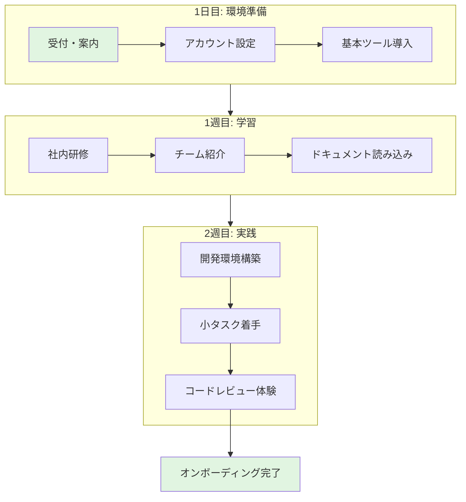
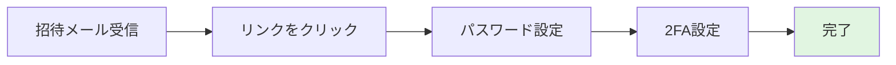
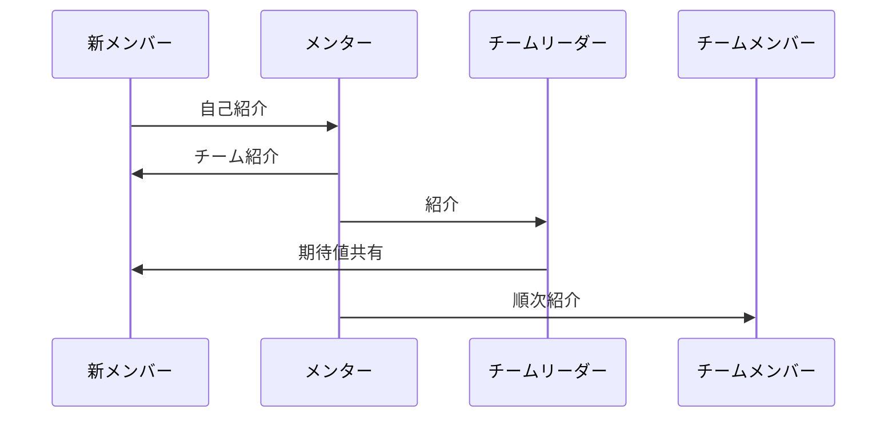
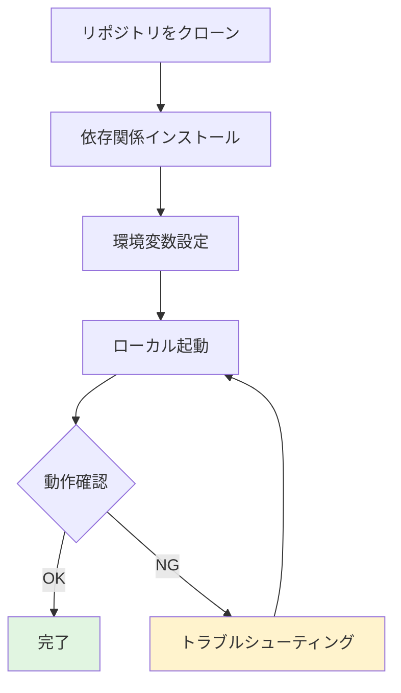

# 新メンバー オンボーディング手順書

## 概要

この手順書では、新しくチームに加わったメンバーが初日から2週間で業務を開始できるようになるまでの流れを説明します。本手順を完了すると、開発環境のセットアップ、社内ツールへのアクセス、基本的な業務フローの理解が完了します。

## 前提条件

この手順を開始する前に、以下が完了していることを確認してください:

- [ ] 入社手続き完了（人事部確認済み）
- [ ] PCおよび社員証の受け取り
- [ ] 社内メールアカウントの発行

### 必要な情報

- 社員番号
- 部署・チーム名
- 直属の上司名
- メンター担当者名

## 作業フロー全体像



---

## 手順

### 1日目: 環境準備

#### ステップ1: 受付・オリエンテーション

1. 9:00に受付で人事担当者と合流
2. 執務エリアへ案内
3. 席の確認、備品の受け取り

> **ポイント**: 社員証は常に携帯してください。入退室に必要です。

#### ステップ2: アカウント設定

以下のアカウントを設定します:

| サービス | 用途 | 設定方法 |
|---------|------|---------|
| メール | 社内外連絡 | IT部門が設定済み |
| Slack | チャット | 招待メールから登録 |
| GitHub | コード管理 | 管理者が招待 |
| Jira | タスク管理 | 招待メールから登録 |



1. 招待メールを確認
2. 各サービスにログイン
3. パスワードを設定（12文字以上、英数字記号混合）
4. 二要素認証（2FA）を設定

> **注意**: パスワードは他のサービスと共有しないでください。

#### ステップ3: 基本ツールのインストール

開発に必要なツールをインストールします:

- [ ] エディタ（VS Code推奨）
- [ ] Git
- [ ] Docker Desktop
- [ ] 社内VPNクライアント

---

### 1週目: 学習フェーズ

#### ステップ4: 社内研修の受講

以下の研修を受講してください:

| 研修名 | 所要時間 | 形式 |
|-------|---------|------|
| セキュリティ研修 | 2時間 | eラーニング |
| コンプライアンス研修 | 1時間 | eラーニング |
| 開発プロセス研修 | 3時間 | 対面 |

#### ステップ5: チームメンバーとの顔合わせ



1. メンターと1on1（30分）
2. チームリーダーと面談（30分）
3. チームメンバーへの挨拶

#### ステップ6: ドキュメントの読み込み

以下のドキュメントを読んでください:

- [ ] チーム運営ガイド
- [ ] コーディング規約
- [ ] システムアーキテクチャ概要
- [ ] 開発フロー説明

---

### 2週目: 実践フェーズ

#### ステップ7: 開発環境の構築



1. リポジトリをクローン
   ```bash
   git clone https://github.com/company/project.git
   ```

2. 依存関係をインストール
   ```bash
   npm install
   ```

3. 環境変数を設定
   ```bash
   cp .env.example .env
   # .envを編集
   ```

4. ローカルで起動
   ```bash
   npm run dev
   ```

#### ステップ8: 最初のタスクに着手

1. Jiraで「onboarding」ラベルのタスクを確認
2. 簡単なタスクを1つ選択
3. ブランチを作成して作業開始

#### ステップ9: コードレビューを体験

1. 作業完了後、プルリクエストを作成
2. メンターにレビューを依頼
3. フィードバックを反映
4. マージ

---

## 確認事項

オンボーディング完了時に、以下が完了していることを確認してください:

### アカウント・環境

- [ ] 全ての社内ツールにログインできる
- [ ] 2FAが設定されている
- [ ] 開発環境でアプリが起動する
- [ ] VPN接続ができる

### 知識・理解

- [ ] チームメンバーの名前と役割を把握している
- [ ] 開発フローを理解している
- [ ] コーディング規約を読んだ
- [ ] 困ったときの相談先を知っている

### 実績

- [ ] 最初のプルリクエストがマージされた

---

## トラブルシューティング

### 招待メールが届かない

**症状**: Slack/GitHub等の招待メールが届かない

**原因**: メールフィルタ、またはアドレス誤り

**対処法**:
1. 迷惑メールフォルダを確認
2. IT部門に連絡（内線: xxxx）

### 開発環境が起動しない

**症状**: `npm run dev`でエラーが発生する

**原因**: 依存関係の問題、環境変数の未設定

**対処法**:
1. `node_modules`を削除して再インストール
2. `.env`ファイルの設定を確認
3. 解決しない場合はメンターに相談

### VPN接続できない

**症状**: VPNに接続できない、頻繁に切断される

**原因**: 設定ミス、ネットワーク環境

**対処法**:
1. VPNクライアントを再起動
2. 接続先サーバーを変更
3. IT部門に連絡

---

## 関連資料

- [開発環境構築ガイド（詳細版）]()
- [コーディング規約]()
- [チームWiki]()

---

## お問い合わせ

- メンター: [メンター名]
- IT部門: it-support@example.com（内線: xxxx）
- 人事部: hr@example.com
