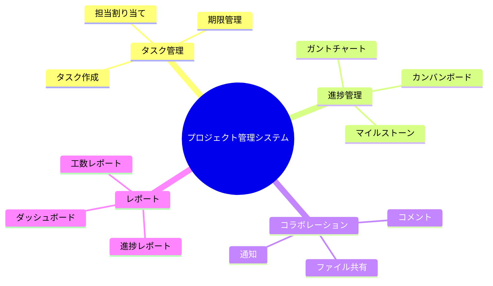
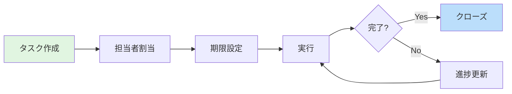
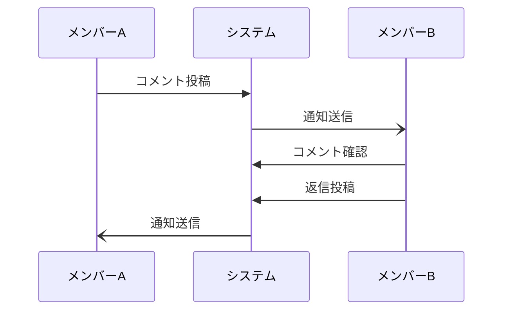
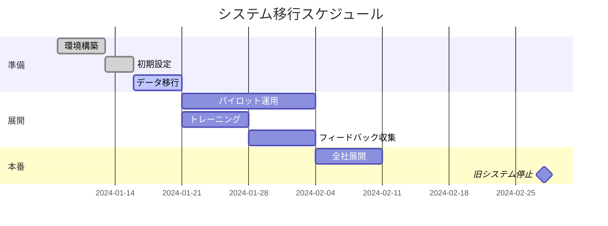

# プロジェクト管理システム導入について

## 概要

本資料では、当社に新しく導入するプロジェクト管理システムについて説明します。このシステムにより、チーム間のコラボレーションが改善され、プロジェクトの進捗管理が効率化されます。

## 背景

現在、プロジェクト管理に以下の課題があります:

- 複数ツールの併用による情報の分散
- 進捗状況の把握に時間がかかる
- チーム間の情報共有が不十分

これらを解決するため、統合的なプロジェクト管理システムを導入します。

## 目的

この資料では以下を説明します:

- 新システムの全体像と主要機能
- 導入による期待効果
- 移行スケジュール

## 対象読者

- プロジェクトマネージャー
- チームリーダー
- 一般メンバー（利用者として）

## 対象範囲

### 含まれるもの

- システムの機能概要
- 利用方法の基本
- 移行計画

### 含まれないもの

- 詳細な操作マニュアル（別途提供）
- 管理者向け設定ガイド

---

## システム全体像

## 主要機能

### 1. タスク管理

プロジェクト内のタスクを一元管理します。

**特徴**:
- 親タスク・子タスクの階層構造
- 担当者・期限・優先度の設定
- ラベルによる分類

### 2. 進捗管理

複数のビューでプロジェクト状況を把握できます。

| ビュー | 用途 | 適した場面 |
|-------|------|-----------|
| カンバン | ステータス別管理 | デイリー確認 |
| ガント | スケジュール管理 | 計画・調整 |
| リスト | 一覧表示 | 詳細確認 |

### 3. コラボレーション機能

---

## 期待効果

### 定量的効果

| 項目 | 現状 | 導入後（目標） |
|-----|------|---------------|
| 進捗確認時間 | 30分/日 | 10分/日 |
| 情報共有の遅延 | 1-2日 | リアルタイム |
| ツール数 | 5種類 | 1種類 |

### 定性的効果

- チーム間の透明性向上
- 意思決定の迅速化
- リモートワークへの対応強化

---

## 移行スケジュール

### マイルストーン

| 日付 | マイルストーン | 内容 |
|-----|---------------|------|
| 1月15日 | データ移行完了 | 既存データの移行 |
| 1月29日 | パイロット完了 | 先行チームでの検証 |
| 2月28日 | 全社展開完了 | 旧システム停止 |

---

## まとめ

- 新システムにより、プロジェクト管理を一元化
- 3つの主要機能: タスク管理・進捗管理・コラボレーション
- 2月末までに全社展開完了予定

## 関連情報

- [操作マニュアル（準備中）]()
- [FAQ（準備中）]()
- 問い合わせ先: システム管理部
