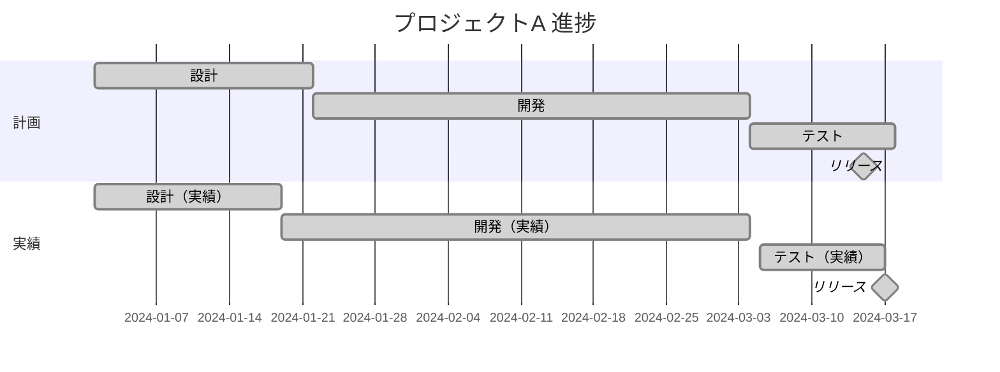
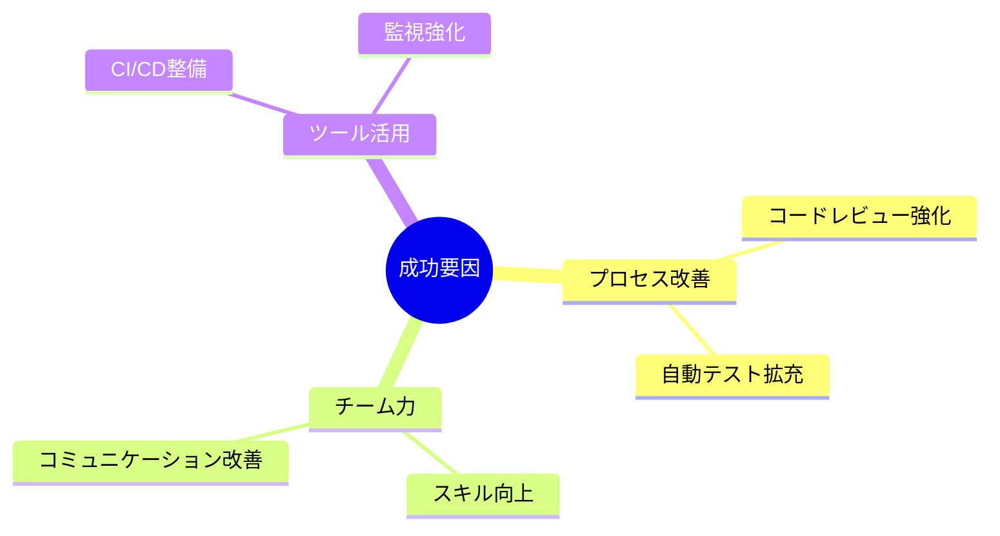
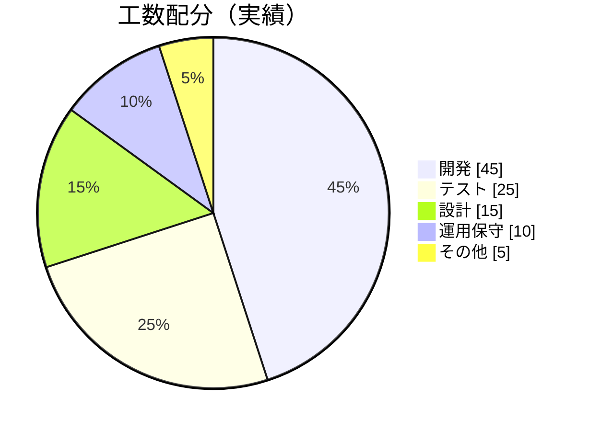
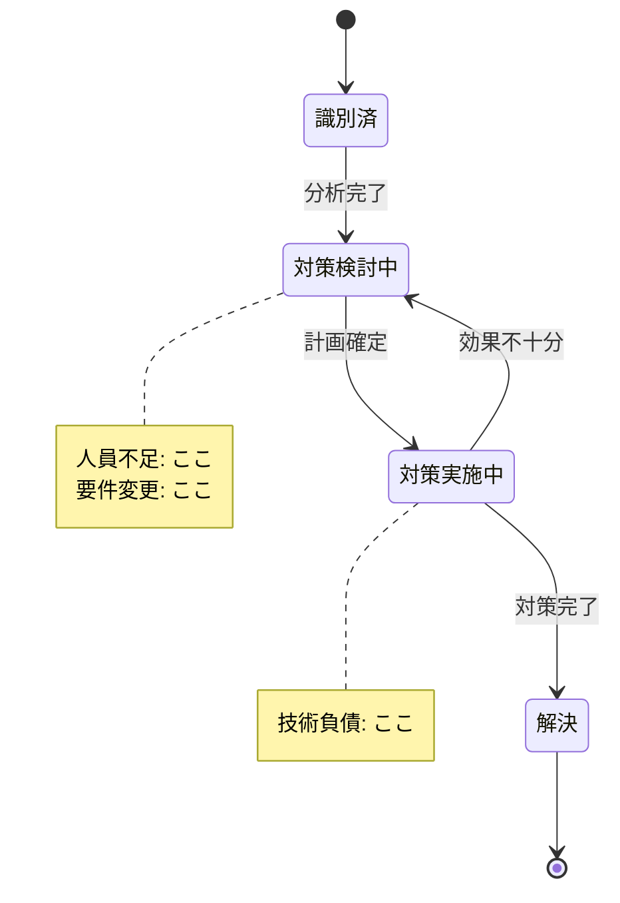
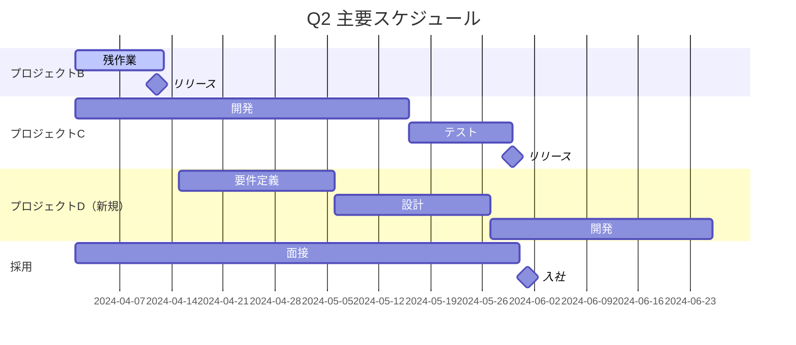

# 2024年度 Q1 活動報告書

**報告者**: 開発部 山田太郎
**報告日**: 2024-04-05
**対象期間**: 2024-01-01 〜 2024-03-31

---

## サマリー

2024年度Q1は、主要プロジェクトの予定通りの進捗と、新規案件の獲得により、全体として計画を上回る成果を達成しました。一方で、人員不足による一部タスクの遅延が発生しており、Q2に向けた体制強化が課題です。

**ハイライト**:
- プロジェクトAの予定通りリリース完了
- 新規案件2件の受注
- チーム生産性が前期比15%向上

**注意点**:
- プロジェクトBに2週間の遅延
- エンジニア採用が計画未達（2名/4名）

---

## 実績

### 概況

Q1は3つの主要プロジェクトを並行して推進しました。プロジェクトAは3月にリリースを完了、プロジェクトBは一部遅延があるものの4月上旬完了見込み、プロジェクトCは計画通り進行中です。

### 主要指標

| 指標 | 目標 | 実績 | 達成率 | 前期比 |
|-----|------|------|--------|-------|
| リリース数 | 2件 | 2件 | 100% | +1件 |
| 売上 | 5,000万円 | 5,200万円 | 104% | +8% |
| 障害発生件数 | 3件以下 | 2件 | 達成 | -1件 |
| 顧客満足度 | 4.0 | 4.2 | 105% | +0.3 |

### プロジェクト別実績

#### プロジェクトA（顧客管理システム刷新）

**結果**: 予定より2日遅延でリリース完了（許容範囲内）

#### プロジェクトB（ECサイト構築）

**結果**: 2週間遅延（4月12日完了見込み）

**遅延要因**:
1. 要件の追加変更（+5日）
2. 外部API連携の技術課題（+9日）

#### プロジェクトC（社内システム改善）

**結果**: 計画通り進行中（Q2完了予定）

---

## 分析

### 成功要因

1. **自動テストカバレッジ向上**: 80%→92%に改善し、品質向上と手戻り削減
2. **デイリースクラムの定着**: 問題の早期発見と対応が可能に
3. **技術勉強会の実施**: 月2回の勉強会でスキル底上げ

### 未達要因

1. **要件変更への対応**: プロジェクトBで途中変更が多発
   - 対策: 変更管理プロセスの厳格化
2. **採用の遅れ**: 市場の人材不足により計画未達
   - 対策: 採用チャネルの多様化、リファラル強化

### 構成比分析

---

## 課題と対策

| 課題 | 影響 | 対策 | 担当 | 期限 |
|-----|------|------|-----|------|
| 人員不足 | 高 | 採用強化、外部委託検討 | 部長 | Q2末 |
| 要件変更多発 | 中 | 変更管理プロセス導入 | PM | 4月末 |
| 技術負債 | 中 | リファクタリング計画策定 | TL | 5月末 |

### 課題の状態

---

## 次のステップ

### Q2 目標

| 指標 | 目標 |
|-----|------|
| リリース数 | 3件 |
| 売上 | 5,500万円 |
| 採用 | 2名 |

### 短期アクション（〜4月末）

- [ ] プロジェクトBリリース完了
- [ ] Q2計画の詳細化
- [ ] 新規案件のキックオフ

### 中期アクション（5-6月）

- [ ] プロジェクトC完了
- [ ] 技術負債解消着手
- [ ] 新メンバーのオンボーディング

---

## Q2 スケジュール（予定）

---

## 補足資料

- [プロジェクト別詳細レポート]()
- [財務データ詳細]()
- [顧客満足度調査結果]()

---

*本報告に関する質問は、開発部 山田（yamada@example.com）まで。*
