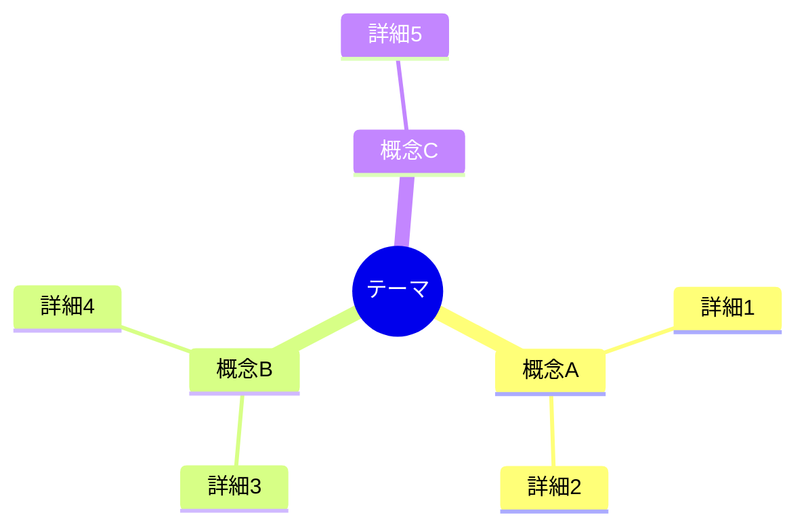
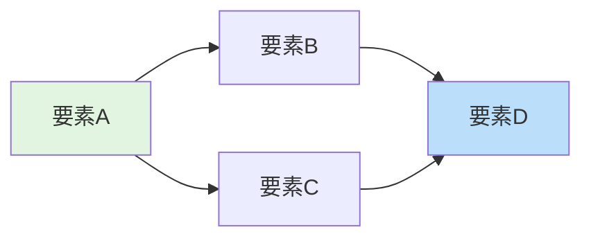

# 説明資料テンプレート

概念・仕組み・背景を伝えるための資料テンプレートです。

---

## テンプレート

```markdown
# [タイトル]

## 1. はじめに

[この資料で説明する内容の概要を1-2段落で記述]

### 背景

[なぜこの説明が必要なのか、どのような課題や状況があるのかを記述]

### 目的

この資料では以下を説明します:

- [説明項目1]
- [説明項目2]
- [説明項目3]

### 対象読者

- [対象者1]
- [対象者2]

## 2. Input

| No. | 概要 | URLリンク |
|-----|------|----------|
| 1 | [参照文書1の説明] | [リンク]() |
| 2 | [参照文書2の説明] | [リンク]() |
| 3 | [参照文書3の説明] | [リンク]() |

## 3. 対象範囲

### 含まれるもの

- [範囲内の項目1]
- [範囲内の項目2]

### 含まれないもの

- [範囲外の項目1]
- [範囲外の項目2]

## 4. [本題セクション1]

[詳細な説明]

<!-- 適切な場合は図解を追加 -->

## 5. [本題セクション2]

[詳細な説明]

## 6. まとめ

[要点の整理]
```

---

## 章構成ガイド

| セクション | 目的 | 記載のポイント |
|-----------|------|---------------|
| はじめに | 全体像を伝える | 背景・目的・対象読者を含む |
| Input | 前提知識を共有 | 参照すべき文書をリンク付きで |
| 対象範囲 | 境界を明確にする | 「含まれないもの」が重要 |
| 本題 | 情報を伝達する | 図解を活用 |
| まとめ | 記憶を定着させる | 重要ポイントを再掲 |

## 図解の活用

### 全体構造を示す



### 関係性を示す



### 比較を示す

| 観点 | オプションA | オプションB |
|-----|------------|------------|
| 特徴1 | 値A1 | 値B1 |
| 特徴2 | 値A2 | 値B2 |
| 特徴3 | 値A3 | 値B3 |

## 作成のコツ

1. **結論を先に**: 読者は「何がわかるか」を最初に知りたい
2. **階層構造で整理**: 大→中→小の順で説明
3. **具体例を添える**: 抽象的な概念には必ず例を
4. **図解は補助**: 文章で説明した上で図解を追加
5. **専門用語は解説**: 初出時に説明を添える
