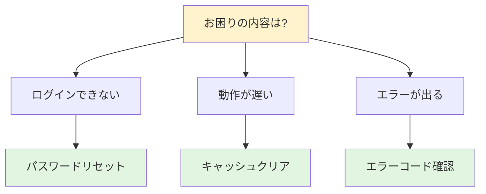
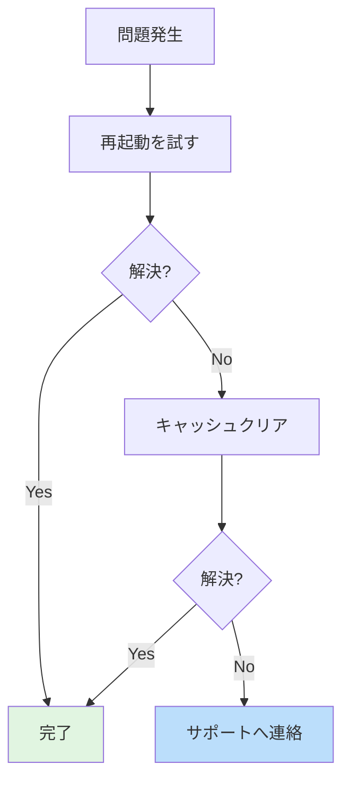

# FAQテンプレート

よくある質問に答えるための資料テンプレートです。

---

## テンプレート

```markdown
# [サービス/製品名] FAQ

最終更新: [YYYY-MM-DD]

---

## 目次

- [基本について](#基本について)
- [使い方について](#使い方について)
- [トラブルシューティング](#トラブルシューティング)
- [料金について](#料金について)

---

## 基本について

### Q. [質問1]?

[回答1]

### Q. [質問2]?

[回答2]

---

## 使い方について

### Q. [質問3]?

[回答3]

1. [手順1]
2. [手順2]
3. [手順3]

### Q. [質問4]?

[回答4]

---

## トラブルシューティング

### Q. [問題1]が発生した場合は?

**原因**: [考えられる原因]

**対処法**:
1. [対処1]
2. [対処2]

それでも解決しない場合は[サポート窓口]へ問い合わせる。

### Q. [問題2]が発生した場合は?

[回答]

---

## 料金について

### Q. [料金に関する質問1]?

[回答]

| プラン | 料金 | 特徴 |
|-------|------|------|
| [プラン1] | [料金] | [特徴] |
| [プラン2] | [料金] | [特徴] |

---

## お問い合わせ

上記で解決しない場合は、以下へ問い合わせる:

- メール: [email]
- 電話: [番号]
- 受付時間: [時間帯]
```

---

## 章構成ガイド

| セクション | 目的 | 記載のポイント |
|-----------|------|---------------|
| 目次 | 素早くアクセス | カテゴリへのリンク |
| カテゴリ | 質問をグループ化 | 論理的な分類 |
| Q&A | 質問と回答 | 簡潔明瞭に |
| お問い合わせ | 解決しない場合の誘導 | 連絡先を明記 |

## カテゴリ設計のパターン

### ユーザージャーニー型

```
1. 導入前の質問（検討段階）
2. 導入時の質問（セットアップ）
3. 利用中の質問（運用）
4. トラブル対応
```

### 機能別

```
1. 機能Aについて
2. 機能Bについて
3. 機能Cについて
```

### 対象者別

```
1. 初めての方へ
2. 管理者向け
3. 開発者向け
```

## 図解の活用

### 選択フロー



### 対処フロー



### 比較表

| 機能 | 無料プラン | 有料プラン |
|-----|----------|-----------|
| 機能A | 制限あり | 無制限 |
| 機能B | 利用不可 | 利用可能 |
| サポート | メールのみ | 電話対応 |

## 作成のコツ

1. **ユーザー目線の質問文**: 社内用語を避ける
2. **検索しやすいキーワード**: よく使う言葉を含める
3. **簡潔な回答**: 長文は避け、詳細は別ページへ
4. **定期的な更新**: 問い合わせ傾向を反映
5. **関連質問へのリンク**: 「関連: [別のQ&A]」
6. **最終更新日を明記**: 情報の鮮度を示す

## Q&A記述パターン

### シンプルな回答

```markdown
### Q. 支払い方法は何がありますか?

クレジットカード、銀行振込、コンビニ払いに対応しています。
```

### 手順を含む回答

```markdown
### Q. パスワードを変更するには?

以下の手順で変更する:

1. 設定画面を開く
2. 「セキュリティ」を選択
3. 「パスワード変更」をクリック
4. 新しいパスワードを入力
```

### 条件分岐がある回答

```markdown
### Q. 解約手数料はかかりますか?

ご利用期間により異なります:

- **1年未満**: 手数料 [金額]
- **1年以上**: 無料
```

### 注意点を含む回答

```markdown
### Q. データのバックアップ方法は?

設定画面から「エクスポート」を選択する。

> **注意**: エクスポートには最大30分かかる場合があります。
> 処理中はブラウザを閉じないこと。
```

## メンテナンスのポイント

- 問い合わせ頻度の高い質問を上位に
- 古い情報は定期的に見直し
- 新機能リリース時にFAQも更新
- ユーザーフィードバックを反映
