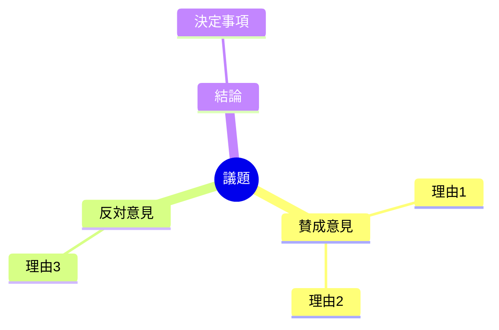
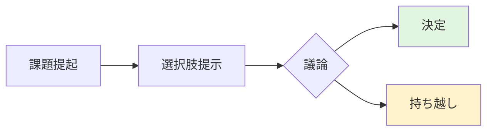
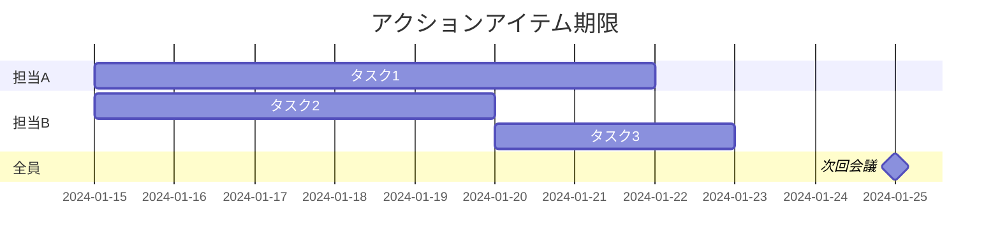

# 会議議事録テンプレート

会議内容を記録するための資料テンプレートです。

---

## テンプレート

```markdown
# [会議名]

## 会議情報

| 項目 | 内容 |
|-----|------|
| 日時 | YYYY-MM-DD HH:MM - HH:MM |
| 場所 | [会議室名/オンライン] |
| 参加者 | [名前1], [名前2], [名前3] |
| 欠席者 | [名前4] |
| 記録者 | [名前] |

## 目的

[この会議で達成したいこと]

---

## アジェンダ

1. [議題1]（[担当者], [予定時間]分）
2. [議題2]（[担当者], [予定時間]分）
3. [議題3]（[担当者], [予定時間]分）

---

## 議論内容

### 1. [議題1]

**発表者**: [名前]

**内容**:
[議論の要約]

**主な意見**:
- [意見1]（[発言者]）
- [意見2]（[発言者]）

**結論**: [決まったこと/持ち越し]

### 2. [議題2]

**発表者**: [名前]

**内容**:
[議論の要約]

---

## 決定事項

| No | 決定内容 | 関連議題 |
|----|---------|---------|
| 1 | [決定1] | 議題1 |
| 2 | [決定2] | 議題2 |

---

## アクションアイテム

| No | タスク | 担当者 | 期限 | 状態 |
|----|-------|-------|------|------|
| 1 | [タスク1] | [名前] | [YYYY-MM-DD] | [ ] |
| 2 | [タスク2] | [名前] | [YYYY-MM-DD] | [ ] |
| 3 | [タスク3] | [名前] | [YYYY-MM-DD] | [ ] |

---

## 次回会議

| 項目 | 内容 |
|-----|------|
| 日時 | [YYYY-MM-DD HH:MM] |
| 場所 | [場所] |
| 議題（予定） | [議題] |

---

## 補足資料

- [資料1へのリンク]
- [資料2へのリンク]
```

---

## 章構成ガイド

| セクション | 目的 | 記載のポイント |
|-----------|------|---------------|
| 会議情報 | 基本情報を明示 | 参加者は漏れなく |
| 目的 | 会議のゴールを共有 | 事前に設定 |
| アジェンダ | 議題一覧 | 時間配分も記載 |
| 議論内容 | 詳細を記録 | 発言者と内容をセット |
| 決定事項 | 確定内容を明確に | 曖昧な表現を避ける |
| アクションアイテム | 次の行動を明確に | 担当・期限を必須 |
| 次回会議 | 継続性を確保 | 日程を確定させる |

## 図解の活用

### 議論の構造化



### 検討プロセス



### アクションの流れ



## 作成のコツ

1. **リアルタイム記録**: 会議中に記録、終了後に整形
2. **発言者を明記**: 誰が何を言ったか追跡可能に
3. **決定と検討を区別**: 「決まったこと」と「話し合ったこと」を分ける
4. **アクションは5W1H**: 何を・誰が・いつまでにを明確に
5. **共有は即日**: 記憶が新鮮なうちに確認してもらう
6. **前回の振り返り**: 継続議題は前回との繋がりを示す

## 会議タイプ別のポイント

### 定例会議

- 前回アクションアイテムの進捗確認から始める
- 同じフォーマットを維持

### 意思決定会議

- 選択肢と判断基準を明記
- 決定の根拠を記録

### ブレインストーミング

- アイデアは否定せず全て記録
- 分類・整理は会議後に

### 報告会議

- 質疑応答を記録
- 次のアクションに繋げる

## クイックテンプレート（簡易版）

```markdown
# [会議名] - [日付]

**参加者**: [名前1], [名前2]

## 決定事項
- [決定1]
- [決定2]

## アクション
- [ ] [タスク1] @[担当] 〜[期限]
- [ ] [タスク2] @[担当] 〜[期限]

## 次回
[日時] [議題]
```
