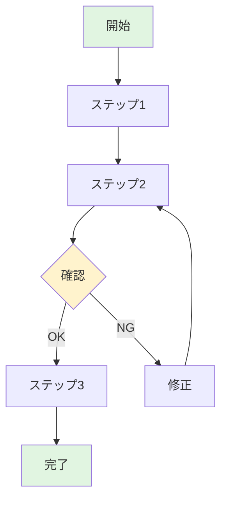
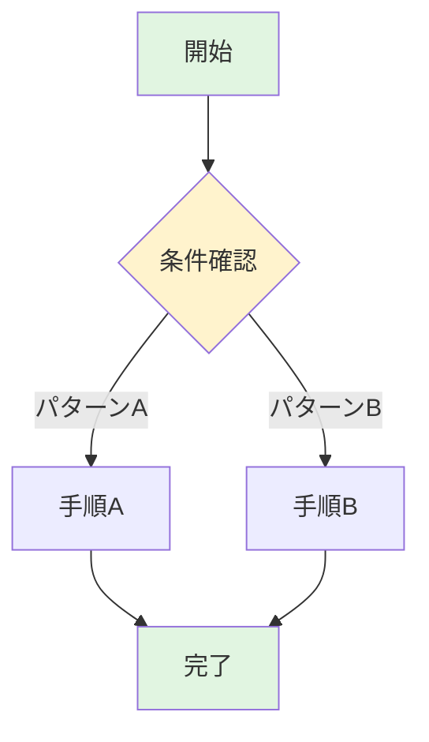
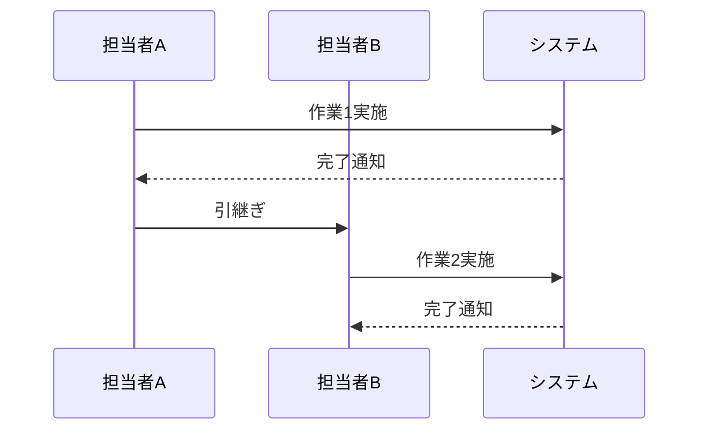

# 手順書テンプレート

作業手順を案内するための資料テンプレートです。

---

## テンプレート

```markdown
# [手順書タイトル]

## 1. はじめに

[この手順で何ができるか、何が達成されるかを1-2段落で記述]

## 2. Input

| No. | 概要 | URLリンク |
|-----|------|----------|
| 1 | [参照文書1の説明] | [リンク]() |
| 2 | [参照文書2の説明] | [リンク]() |
| 3 | [参照文書3の説明] | [リンク]() |

## 3. 前提条件

この手順を実施する前に、以下が完了していること:

- [ ] [前提条件1]
- [ ] [前提条件2]
- [ ] [前提条件3]

### 必要な権限

- [権限1]
- [権限2]

### 必要なツール/環境

- [ツール1]
- [ツール2]

## 4. 作業フロー

<!-- 全体の流れを図解 -->

## 5. 手順

### ステップ1: [ステップ名]

[詳細な説明]

1. [操作1]
2. [操作2]
3. [操作3]

> **ポイント**: [補足説明や注意点]

### ステップ2: [ステップ名]

[詳細な説明]

### ステップ3: [ステップ名]

[詳細な説明]

## 6. 確認事項

作業完了後、以下を確認する:

- [ ] [確認項目1]
- [ ] [確認項目2]
- [ ] [確認項目3]

## 7. トラブルシューティング

### [問題1]

**症状**: [問題の症状]

**原因**: [考えられる原因]

**対処法**: [解決手順]

### [問題2]

**症状**: [問題の症状]

**原因**: [考えられる原因]

**対処法**: [解決手順]
```

---

## 章構成ガイド

| セクション | 目的 | 記載のポイント |
|-----------|------|---------------|
| はじめに | 目的を明示 | 完了時の状態を説明 |
| Input | 前提知識を共有 | 参照すべき文書をリンク付きで |
| 前提条件 | 準備を促す | チェックリスト形式 |
| 作業フロー | 全体像を示す | フローチャートで図解 |
| 手順 | 実行を案内 | 1ステップ1操作 |
| 確認事項 | 完了を確認 | チェックリスト形式 |
| トラブルシューティング | 問題解決を支援 | 症状→原因→対処の形式 |

## 図解の活用

### 作業フロー全体



### 条件分岐がある場合



### 複数担当者がいる場合



## 作成のコツ

1. **1ステップ1操作**: 複数操作を1ステップに詰め込まない
2. **スクリーンショット活用**: 画面操作には画像を添付
3. **コマンドは正確に**: コピペできる形式で記載
4. **分岐を明示**: 条件によって手順が変わる場合は図解
5. **戻り手順も記載**: 失敗時のリカバリ方法を含める
6. **所要時間の目安**: 各ステップの目安時間を記載すると親切

## コマンド記載例

```bash
# コメントで何をするか説明
command --option value

# 期待される出力
# > Success: operation completed
```
