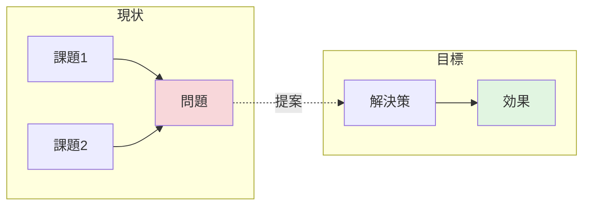
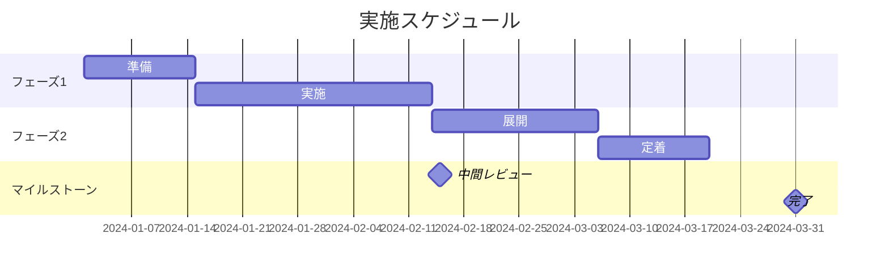
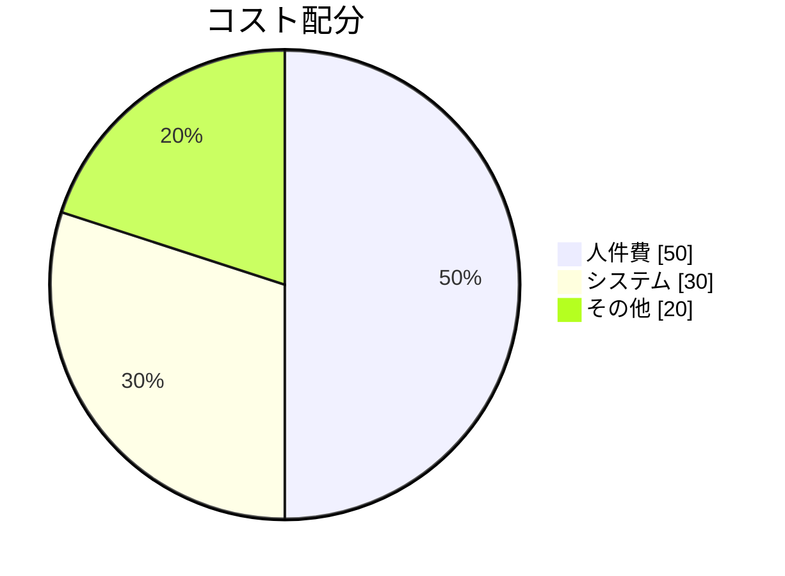

# 提案書テンプレート

承認・意思決定を求めるための資料テンプレートです。

---

## テンプレート

```markdown
# [提案タイトル]

## エグゼクティブサマリー

<!-- 1ページで全体を把握できるように -->

**提案の要点**: [一文で提案内容を説明]

**期待効果**: [主要なメリット]

**必要リソース**: [概算コスト/工数]

**推奨**: [承認/却下/条件付き承認の推奨]

---

## 背景

### 現状

[現在の状況を客観的に記述]

### 課題

[解決すべき問題点]

1. [課題1]
2. [課題2]
3. [課題3]

### なぜ今か

[このタイミングで対応が必要な理由]

## 提案内容

### 概要

[提案する解決策の概要]

### 詳細

[具体的な実施内容]

### 選択肢の比較

<!-- 複数案がある場合 -->

| 観点 | 案A | 案B | 案C（推奨） |
|-----|-----|-----|------------|
| コスト | [値] | [値] | [値] |
| 効果 | [値] | [値] | [値] |
| リスク | [値] | [値] | [値] |

**推奨案**: [推奨する案とその理由]

## 期待効果

### 定量的効果

- [効果1]: [数値/割合]
- [効果2]: [数値/割合]

### 定性的効果

- [効果1]
- [効果2]

## 実施計画

### スケジュール

<!-- ガントチャートで図解 -->

### マイルストーン

| 時期 | マイルストーン | 成果物 |
|------|--------------|--------|
| [日付] | [名称] | [成果物] |
| [日付] | [名称] | [成果物] |

### 必要リソース

| 項目 | 数量/規模 | 備考 |
|------|----------|------|
| 人員 | [値] | [備考] |
| 予算 | [値] | [備考] |
| 期間 | [値] | [備考] |

## リスクと対策

| リスク | 影響度 | 発生確率 | 対策 |
|-------|--------|---------|------|
| [リスク1] | 高/中/低 | 高/中/低 | [対策] |
| [リスク2] | 高/中/低 | 高/中/低 | [対策] |

## 承認依頼

### 依頼事項

- [ ] [承認項目1]
- [ ] [承認項目2]

### 次のステップ

承認後、以下を実施する:

1. [アクション1]
2. [アクション2]

## 補足資料

- [詳細資料へのリンク]
- [関連情報]
```

---

## 章構成ガイド

| セクション | 目的 | 記載のポイント |
|-----------|------|---------------|
| エグゼクティブサマリー | 意思決定の材料を提供 | 1ページ以内、結論を先に |
| 背景 | 必要性を理解させる | 事実ベースで客観的に |
| 提案内容 | 解決策を示す | 複数案を比較して推奨 |
| 期待効果 | 価値を示す | 可能な限り定量化 |
| 実施計画 | 実現性を示す | 具体的なスケジュール |
| リスクと対策 | 信頼性を示す | リスクを隠さない |
| 承認依頼 | アクションを促す | 何を承認してほしいか明確に |

## 図解の活用

### 現状と目標の対比



### 実施スケジュール



### 投資対効果



## 作成のコツ

1. **結論ファースト**: 忙しい意思決定者は最初しか読まない
2. **数字で語る**: 「大きな効果」ではなく「30%削減」
3. **比較を示す**: なぜその案が最善か理由を明示
4. **リスクを隠さない**: 課題を認識していることが信頼につながる
5. **アクションを明確に**: 何を承認してほしいか曖昧にしない
6. **補足は別資料に**: 本編は簡潔に、詳細は添付資料で
