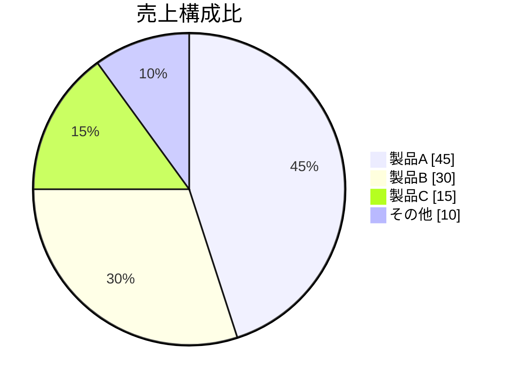
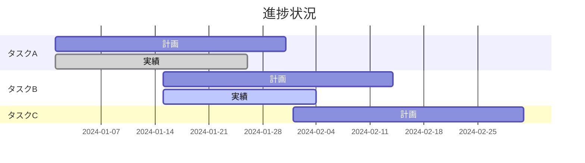
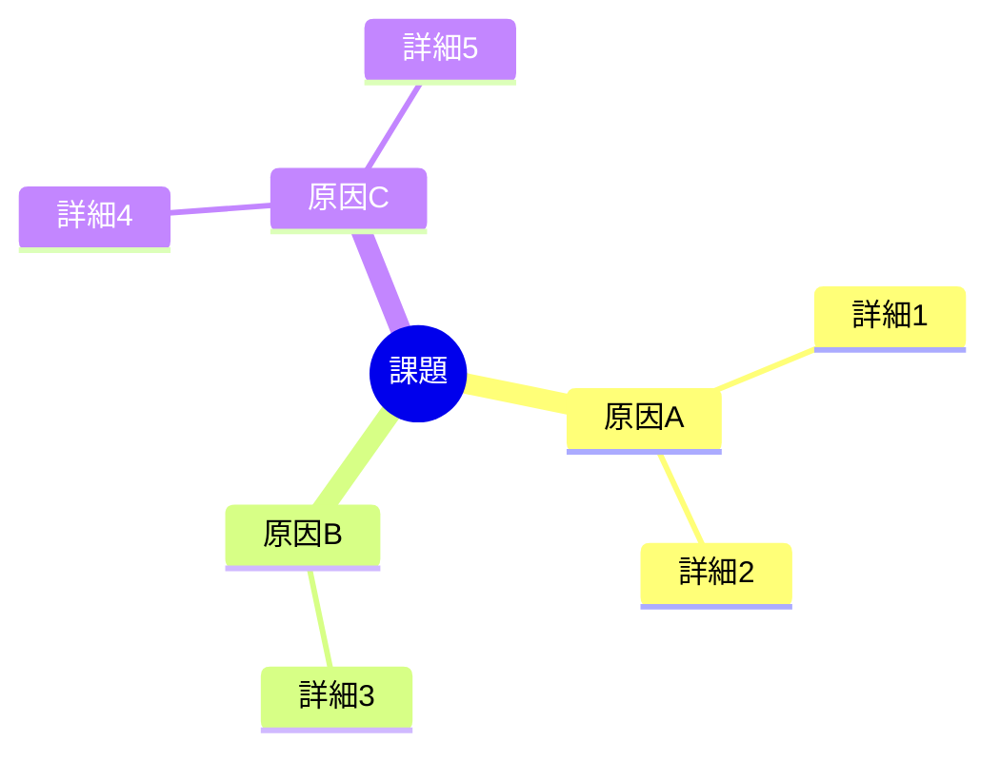
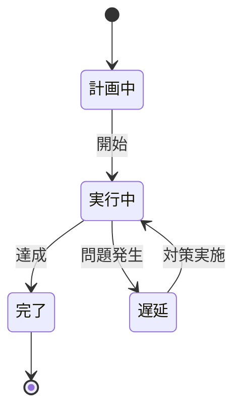

# 報告書テンプレート

実績・結果を報告するための資料テンプレートです。

---

## テンプレート

```markdown
# [報告書タイトル]

**報告者**: [氏名]
**報告日**: [YYYY-MM-DD]
**対象期間**: [YYYY-MM-DD] 〜 [YYYY-MM-DD]

---

## サマリー

<!-- 結論を先に。3-5行で要約 -->

[主要な結果と結論を簡潔に記述]

**ハイライト**:
- [成果1]
- [成果2]

**注意点**:
- [課題/懸念点]

---

## 実績

### 概況

[全体的な状況の説明]

### 主要指標

| 指標 | 目標 | 実績 | 達成率 | 前期比 |
|-----|------|------|--------|-------|
| [指標1] | [値] | [値] | [%] | [%] |
| [指標2] | [値] | [値] | [%] | [%] |
| [指標3] | [値] | [値] | [%] | [%] |

### 詳細実績

#### [カテゴリ1]

[詳細な実績と説明]

#### [カテゴリ2]

[詳細な実績と説明]

## 分析

### 成功要因

[目標達成に寄与した要因]

1. [要因1]
2. [要因2]

### 未達要因

[目標未達の原因分析]

1. [要因1]
2. [要因2]

### トレンド

<!-- グラフで推移を可視化 -->

## 課題と対策

| 課題 | 影響 | 対策 | 担当 | 期限 |
|-----|------|------|-----|------|
| [課題1] | [影響] | [対策] | [担当] | [期限] |
| [課題2] | [影響] | [対策] | [担当] | [期限] |

## 次のステップ

### 短期（〜1ヶ月）

- [ ] [アクション1]
- [ ] [アクション2]

### 中期（1-3ヶ月）

- [ ] [アクション3]
- [ ] [アクション4]

## 補足資料

- [詳細データ]
- [関連レポート]
```

---

## 章構成ガイド

| セクション | 目的 | 記載のポイント |
|-----------|------|---------------|
| サマリー | 全体像を伝える | 結論と重要事項を先に |
| 実績 | 事実を報告 | 数値ベース、客観的に |
| 分析 | 解釈を加える | なぜその結果になったか |
| 課題と対策 | 改善方針を示す | 具体的なアクションまで |
| 次のステップ | 今後を示す | 期限と担当を明確に |

## 図解の活用

### 実績の可視化



### 目標vs実績

| 項目 | 目標 | 実績 | 状況 |
|-----|------|------|------|
| KPI 1 | 100 | 95 | 未達 |
| KPI 2 | 50 | 60 | 達成 |
| KPI 3 | 30 | 30 | 達成 |

### 推移の表現



### 課題の構造化



### プロセスの状態



## 作成のコツ

1. **ファクトベース**: 感想ではなく数値で語る
2. **比較を示す**: 目標/前期/計画との対比
3. **グラフを活用**: 傾向は視覚化すると伝わりやすい
4. **分析と事実を分ける**: 数字（事実）と解釈（分析）を区別
5. **対策まで書く**: 課題の羅列で終わらせない
6. **定点観測**: 同じフォーマットで継続すると比較しやすい

## 報告タイプ別のポイント

### 定期報告（週次/月次）

- 前回からの変化点を強調
- 継続的な指標は推移で見せる

### 完了報告

- 当初計画との対比
- 学んだこと（Lessons Learned）を含める

### 障害/インシデント報告

- 時系列で経緯を記載
- 根本原因分析（RCA）を含める
- 再発防止策を明記
