# Mermaid図解リファレンス

Mermaid記法の簡潔なリファレンスです。

---

## 図の種類と用途

| 図 | 主な用途 | キーワード |
|---|---------|----------|
| フローチャート | 処理の流れ、手順、分岐 | `flowchart` |
| シーケンス図 | 時系列のやり取り | `sequenceDiagram` |
| 状態遷移図 | 状態の変化 | `stateDiagram-v2` |
| ER図 | データの関係性 | `erDiagram` |
| クラス図 | オブジェクト構造 | `classDiagram` |
| ガントチャート | スケジュール | `gantt` |
| 円グラフ | 割合・構成比 | `pie` |
| マインドマップ | 階層・分類 | `mindmap` |

---

## フローチャート

### 基本構文

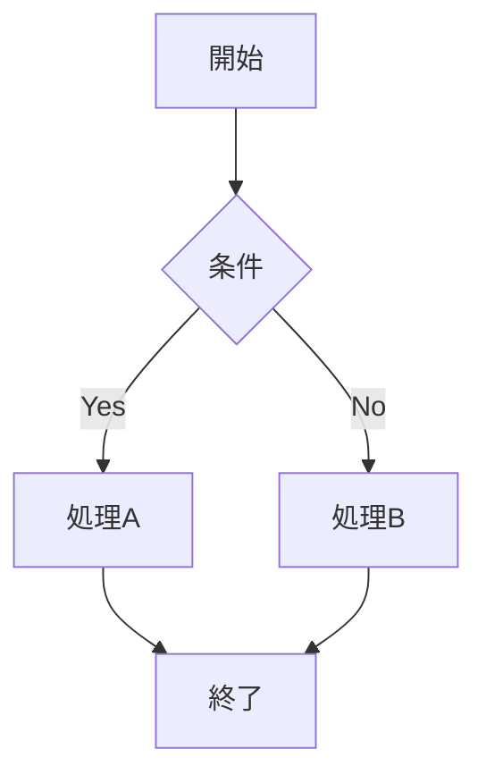

### 方向

| コード | 方向 |
|-------|------|
| `TD` / `TB` | 上→下 |
| `BT` | 下→上 |
| `LR` | 左→右 |
| `RL` | 右→左 |

### ノード形状

| 構文 | 形状 |
|------|------|
| `[text]` | 四角形 |
| `(text)` | 角丸 |
| `{text}` | ひし形（条件） |
| `((text))` | 円 |
| `[[text]]` | 四角形（二重線） |
| `([text])` | スタジアム型 |

### 矢印

| 構文 | 種類 |
|------|------|
| `-->` | 矢印 |
| `---` | 線のみ |
| `-.->` | 点線矢印 |
| `==>` | 太い矢印 |
| `--text-->` | ラベル付き |

### サブグラフ

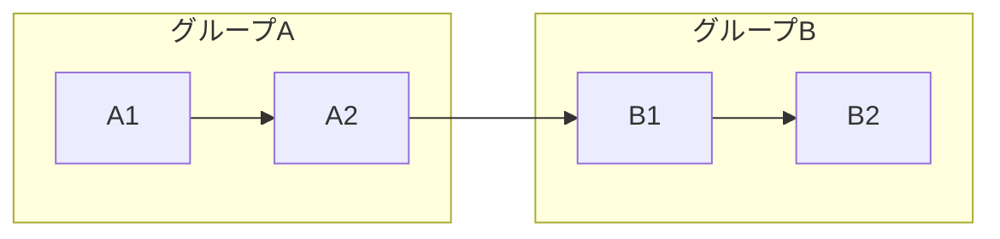

### スタイル

---

## シーケンス図

### 基本構文

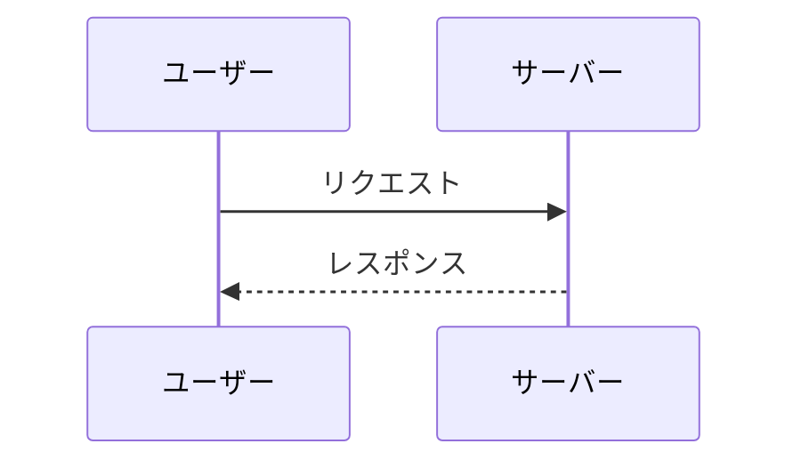

### メッセージ種類

| 構文 | 種類 |
|------|------|
| `->>` | 実線（同期） |
| `-->>` | 点線（応答） |
| `-)` | 非同期 |
| `--)` | 非同期応答 |
| `-x` | 失敗 |

### アクティベーション

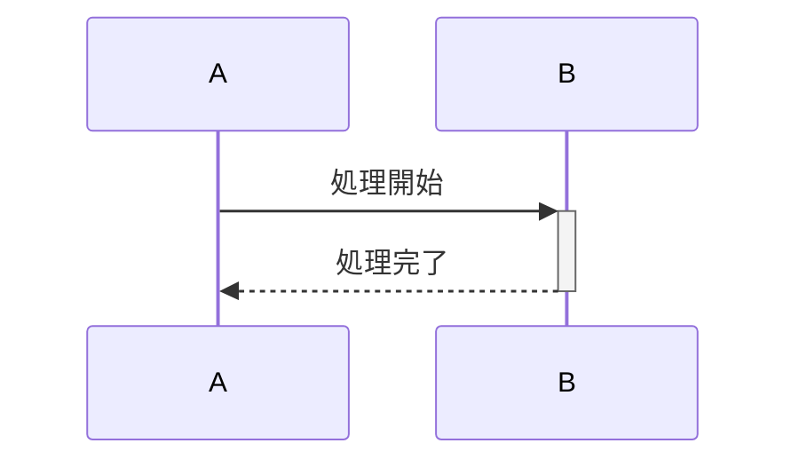

### 条件分岐

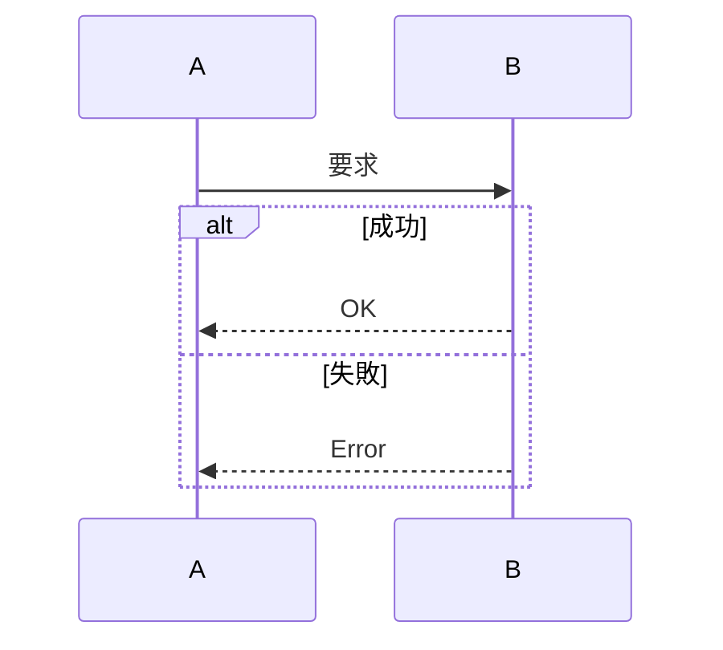

### その他の構文

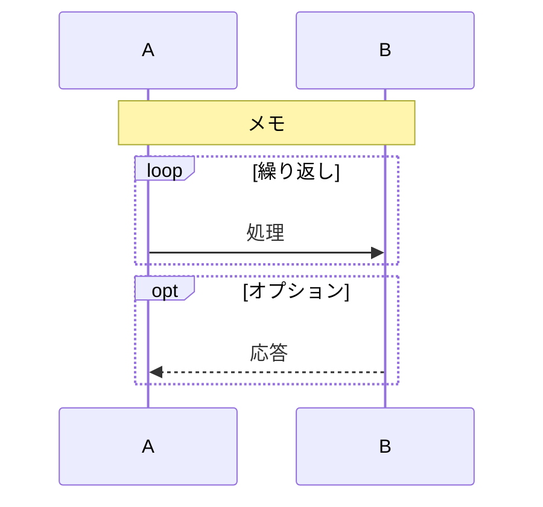

---

## 状態遷移図

### 基本構文

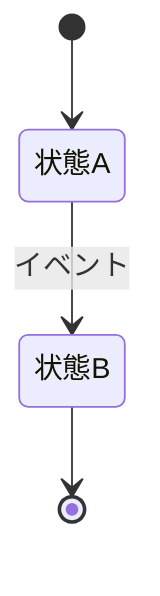

### 複合状態

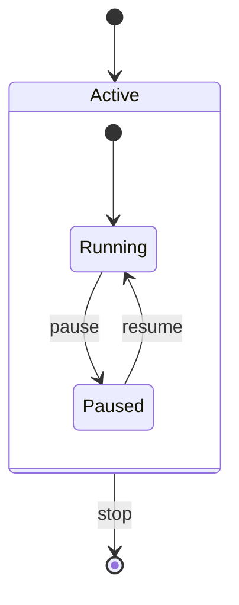

### 分岐

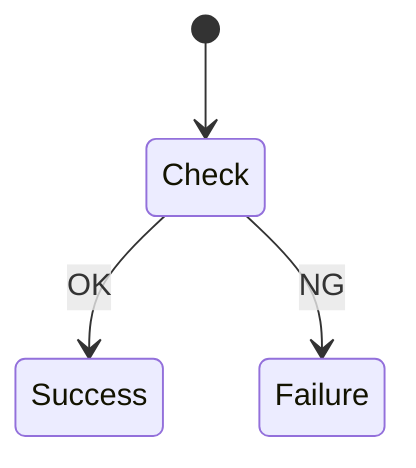

### 注釈

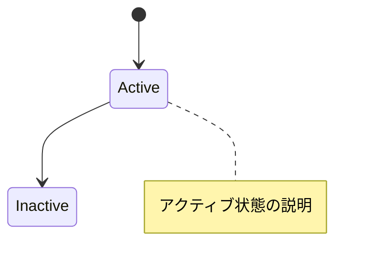

---

## ER図

### 基本構文

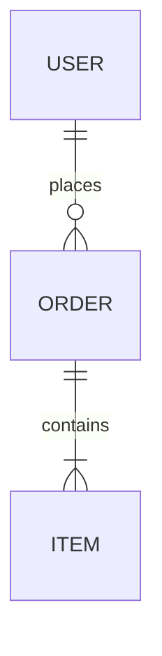

### カーディナリティ

| 記法 | 意味 |
|------|------|
| `\|\|` | 1（必須） |
| `o\|` | 0または1 |
| `\|{` | 1以上 |
| `o{` | 0以上 |

### 属性

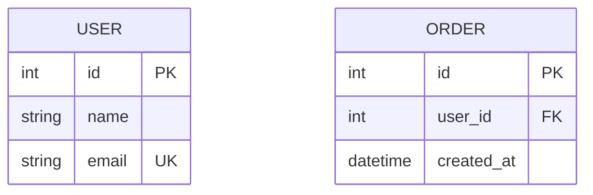

---

## クラス図

### 基本構文

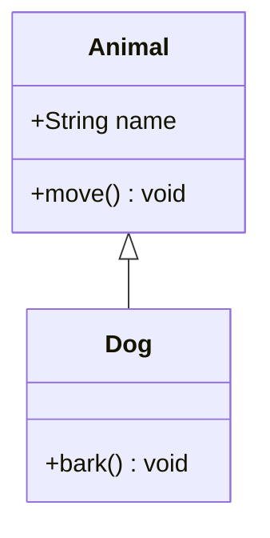

### アクセス修飾子

| 記号 | 意味 |
|------|------|
| `+` | public |
| `-` | private |
| `#` | protected |

### 関係性

| 記法 | 意味 |
|------|------|
| `<\|--` | 継承 |
| `*--` | コンポジション |
| `o--` | 集約 |
| `-->` | 関連 |
| `..\|>` | 実装 |

---

## ガントチャート

### 基本構文

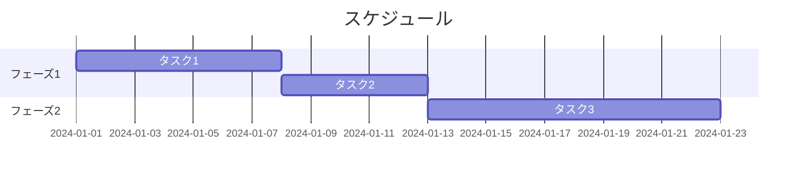

### タスクの状態

| 修飾子 | 意味 |
|--------|------|
| `done` | 完了 |
| `active` | 進行中 |
| `crit` | クリティカル |
| `milestone` | マイルストーン |

### 日付フォーマット

| フォーマット | 例 |
|-------------|-----|
| `YYYY-MM-DD` | 2024-01-15 |
| `5d` | 5日間 |
| `2w` | 2週間 |
| `after a1` | a1の後 |

---

## 円グラフ

### 基本構文

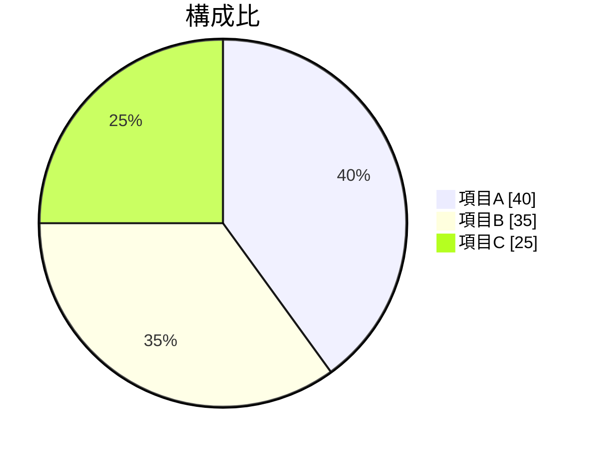

---

## マインドマップ

### 基本構文

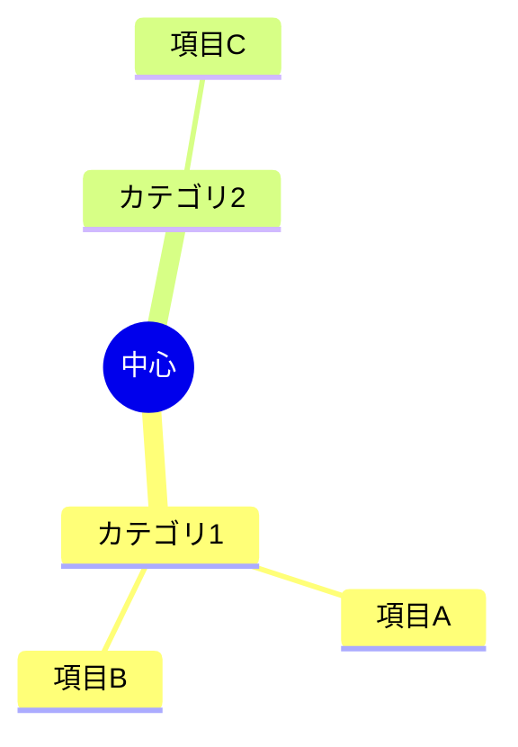

### ノード形状

| 構文 | 形状 |
|------|------|
| `root((text))` | 円（ルート） |
| `text` | 四角形 |
| `(text)` | 角丸 |
| `)text(` | バナー |

---

## スタイリング共通

### カラー

| 用途 | HEX |
|-----|-----|
| 開始/成功 | `#e1f5e1` |
| 処理/通常 | `#bbdefb` |
| 判断/条件 | `#fff3cd` |
| 警告/エラー | `#f8d7da` |
| 強調 | `#ffe0b2` |

### テーマ設定

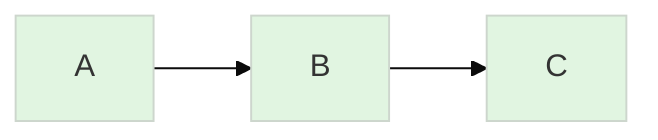

---

## トラブルシューティング

### 図が表示されない

1. [Mermaid Live Editor](https://mermaid.live/)でプレビュー
2. 構文エラーを確認
3. 対応していない記法がないか確認

### 日本語が文字化けする

- UTF-8エンコーディングを確認

### 図が大きすぎる

- ノード数を15以下に
- サブグラフで分割

---

## 参考

- [Mermaid公式ドキュメント](https://mermaid.js.org/)
- [Mermaid Live Editor](https://mermaid.live/)
