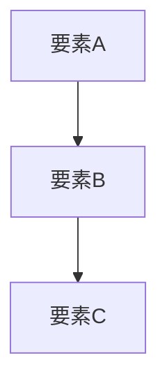

# [資料タイトル]

## はじめに

本資料は、[テーマ] について [目的] を目的として作成したものである。

[背景や動機を1〜2段落で記述する]

## インプット資料

| # | 資料名 | リンク / 格納場所 | 備考 |
|---|--------|------------------|------|
| 1 | [資料名] | [URL or パス] | [任意の補足] |
| 2 | [資料名] | [URL or パス] | [任意の補足] |

## 概要

[テーマの全体像を簡潔に説明する（2〜3段落）]

上図は [テーマ] の全体構成を示している。[図の読み方や要点を補足する]

## 詳細説明

### [サブテーマ1]

[詳細な説明を記述する]

補足：[補足タイトル]

[補足情報を記述する]

### [サブテーマ2]

[詳細な説明を記述する]

## まとめ

[要点を整理する（必要な場合のみ）]
