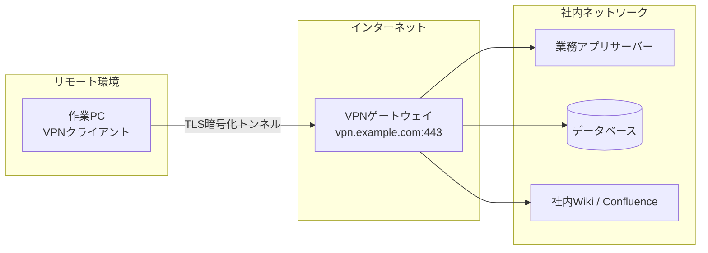
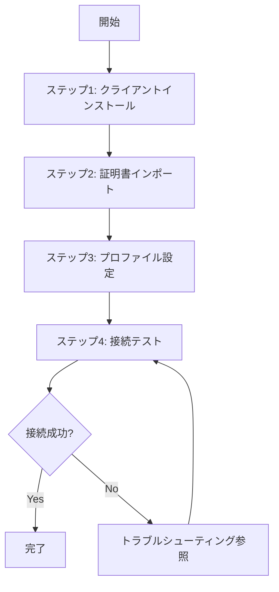

# 社内VPN接続セットアップ手順書

## 1. はじめに

本手順書は、新規メンバーが社内VPNに接続するための初期セットアップ手順をまとめたものである。
本手順を完了すると、リモート環境から社内ネットワークへ安全にアクセスできるようになる。

## 2. インプット資料

| # | 資料名 | リンク / 格納場所 | 備考 |
|---|--------|------------------|------|
| 1 | VPNクライアントダウンロードページ | https://internal.example.com/vpn/download | 社内ネットワークからのみアクセス可 |
| 2 | 証明書発行申請フォーム | https://internal.example.com/cert-request | 初回のみ必要 |
| 3 | ネットワーク部門FAQ | https://confluence.example.com/net/faq | よくある質問集 |

## 3. 前提条件

- [ ] 社員番号が発行されていること
- [ ] 情シス部門から証明書ファイル（`.p12`）を受領していること
- [ ] PCの管理者権限を保有していること
- [ ] インターネットに接続できる環境であること

<details>
<summary>補足：証明書ファイルの受領方法</summary>

証明書ファイルは、入社時またはPC交換時に情シス部門から配布される。
未受領の場合は、上記インプット資料の「証明書発行申請フォーム」から申請する。
通常、申請から1〜2営業日で発行される。

</details>

## 4. 手順

### 4.1 概要

以下にVPN接続に関わるネットワーク構成と、セットアップ作業の流れを示す。

**ネットワーク構成図**



**作業フロー**



作業PCにVPNクライアントをインストールし、証明書認証を設定することで、
インターネット経由でVPNゲートウェイに接続し、社内の各サーバーにアクセス可能となる。
全4ステップで、所要時間は約15〜20分である。

### 4.2 ステップ1：VPNクライアントのインストール

VPN接続に必要なクライアントソフトをインストールする。

1. インプット資料のダウンロードページにアクセスし、OS に合ったインストーラーをダウンロードする

2. ダウンロードしたインストーラーを実行する

   ```powershell
   # Windows の場合（ダウンロードフォルダで実行）
   .\VPNClient-Setup.exe /silent
   ```

3. インストール完了後、PCを再起動する

<details>
<summary>補足：サイレントインストールオプションについて</summary>

`/silent` オプションを付けると、GUIのウィザードを経由せずにデフォルト設定でインストールされる。
カスタムインストールが必要な場合はオプションを外して実行すること。

</details>

### 4.3 ステップ2：証明書のインポート

VPN認証に使用する証明書をインポートする。

1. VPNクライアントを起動する

2. メニューから「設定」→「証明書管理」→「インポート」を選択する

3. 情シス部門から受領した `.p12` ファイルを選択する

4. 証明書のパスワードを入力する（受領時にメールで通知されたもの）

5. 「インポート成功」のメッセージが表示されることを確認する

### 4.4 ステップ3：接続プロファイルの設定

接続先の情報を設定する。

1. VPNクライアントの「接続先設定」画面を開く

2. 以下の情報を入力する

   | 項目 | 値 |
   |------|-----|
   | プロファイル名 | `社内VPN` |
   | サーバーアドレス | `vpn.example.com` |
   | ポート | `443` |
   | 認証方式 | `証明書認証` |

3. 「保存」をクリックする

### 4.5 ステップ4：接続テスト

VPN接続を実施し、正常に通信できることを確認する。

1. VPNクライアントで「社内VPN」プロファイルを選択し、「接続」をクリックする

2. ステータスが「接続済み」になることを確認する

3. 社内サイトにアクセスして表示されることを確認する

   ```bash
   # ターミナルからの確認方法
   ping -c 4 internal.example.com
   ```

4. 正常に応答があれば、セットアップは完了となる

<details>
<summary>補足：接続状態の確認コマンド</summary>

接続中のVPN情報を詳しく確認するには以下のコマンドを使用する。

```bash
# Windows
ipconfig /all | findstr "VPN"

# macOS / Linux
ifconfig | grep -A 5 "tun0"
```

</details>

## 5. トラブルシューティング

### 症状：「証明書が無効です」と表示される

**原因**：証明書の有効期限が切れている、またはインポートが正しく行われていない可能性がある。

**対処法**：

1. VPNクライアントの「証明書管理」画面で証明書の有効期限を確認する
2. 有効期限切れの場合は、インプット資料の申請フォームから再発行を申請する
3. 有効期限内の場合は、証明書を一度削除し、ステップ2からやり直す

### 症状：接続後に社内サイトにアクセスできない

**原因**：DNSの設定が正しく反映されていない可能性がある。

**対処法**：

1. VPNが「接続済み」になっていることを再確認する
2. DNSキャッシュをクリアする

   ```bash
   # Windows
   ipconfig /flushdns

   # macOS
   sudo dscacheutil -flushcache && sudo killall -HUP mDNSResponder
   ```

3. ブラウザを再起動して再度アクセスする
4. 解消しない場合はネットワーク部門に問い合わせる
