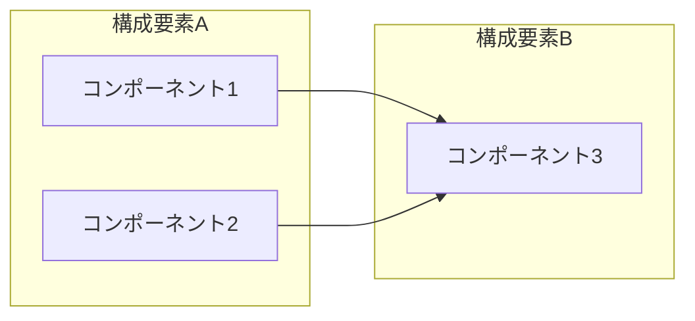

# [手順書タイトル]

## 1. はじめに

[この手順書の目的・背景を簡潔に記述する（2〜3文）]

## 2. インプット資料

| # | 資料名 | リンク / 格納場所 | 備考 |
|---|--------|------------------|------|
| 1 | [資料名] | [URL or パス] | [任意の補足] |
| 2 | [資料名] | [URL or パス] | [任意の補足] |

## 3. 前提条件

- [ ] [前提条件1：例）〇〇のアカウントを保有していること]
- [ ] [前提条件2：例）〇〇がインストール済みであること]
- [ ] [前提条件3：例）〇〇への接続権限があること]

<details>
<summary>補足：前提条件の確認方法</summary>

[前提条件の充足を確認する具体的な方法を記載する]

</details>

## 4. 手順

### 4.1 概要

[Mermaid図を挿入する。内容に最も適した図の種類を選択すること。]



[図の補足説明をテキストで簡潔に記述する。]

### 4.2 ステップ1：[ステップ名]

[このステップの目的を1文で記述する]

1. [具体的な操作1]

   ```bash
   [コマンド例]
   ```

2. [具体的な操作2]

<details>
<summary>補足：[関連する補足トピック]</summary>

[補足情報を記載する]

</details>

### 4.3 ステップ2：[ステップ名]

[同様の構造で記述する]

### 4.N 完了確認

[最終的な確認方法を記載する]

## 5. トラブルシューティング

### 症状：[エラーメッセージや問題の概要]

**原因**：[想定される原因]

**対処法**：

1. [対処手順1]
2. [対処手順2]
