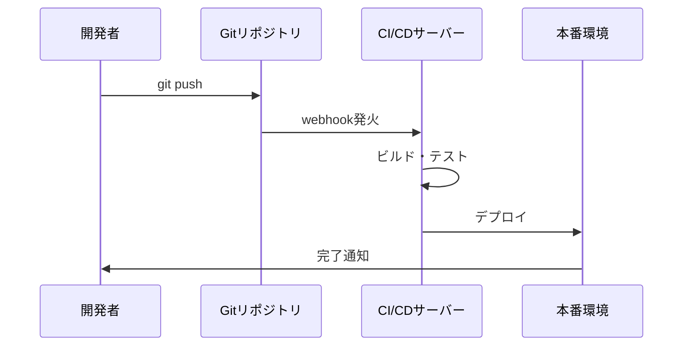

# 手順書作成標準

このインストラクションは、開発手順書および運用手順書のMarkdownファイル作成時に自動的に適用されます。

## 🎯 対象読者の想定

**新人開発者(入社1年目)** が理解できるレベルで記述すること:
- 専門用語には必ず説明を付ける
- 前提知識を明示する
- 「当然知っているはず」という思い込みを排除

## 📋 必須セクション構成

すべての手順書は以下の5セクション構成とする:

### 1. はじめに
```markdown
# [手順書タイトル]

## 1. はじめに

### 目的
この手順書の目的を1-2文で明確に記述

### 対象読者
- 想定する読者層
- 必要な前提知識レベル

### 所要時間
- 標準: XX分
- 初回: XX分 (初めて実施する場合)
```

### 2. Input
必要な情報を表形式で明記:

```markdown
## 2. Input

| 項目 | 説明 | 例 | 必須/任意 |
|------|------|-----|-----------|
| システム名 | 対象システムの識別子 | `payment-api` | 必須 |
| 環境 | デプロイ先環境 | `dev`, `staging`, `prod` | 必須 |
| バージョン | リリースバージョン | `v1.2.3` | 必須 |
```

### 3. 前提条件
```markdown
## 3. 前提条件

### 必要な知識
- [ ] Gitの基本操作 (clone, commit, push)
- [ ] Dockerの基礎知識
- [ ] REST APIの概念

### 必要な環境・ツール
- [ ] Node.js v18以上
- [ ] Docker Desktop
- [ ] VS Code (推奨)

### 事前準備
1. リポジトリへのアクセス権限を取得
2. 開発環境のセットアップ完了
```

### 4. 概要
**必ずMermaid図を含めて全体像を可視化**:

```markdown
## 4. 概要

この手順は以下の流れで実施します:

\`\`\`mermaid
flowchart TD
    Start[開始] --> Check{前提条件確認}
    Check -->|OK| Step1[環境準備]
    Check -->|NG| Fix[不足項目を整備]
    Fix --> Check
    Step1 --> Step2[コード変更]
    Step2 --> Step3[ビルド]
    Step3 --> Step4[テスト実行]
    Step4 --> Verify{結果確認}
    Verify -->|成功| Deploy[デプロイ]
    Verify -->|失敗| Debug[デバッグ]
    Debug --> Step2
    Deploy --> End[完了]
    
    style Start fill:#e1f5e1
    style End fill:#e1f5e1
    style Verify fill:#fff3cd
    style Debug fill:#f8d7da
\`\`\`

### 各ステップの概要
1. **環境準備**: 必要なツールと設定ファイルを準備
2. **コード変更**: 機能実装またはバグ修正
3. **ビルド**: ソースコードをビルド
4. **テスト実行**: 単体テスト・結合テストを実施
5. **デプロイ**: 本番環境またはステージング環境へデプロイ
```

### 5. ユースケース毎の手順
```markdown
## 5. 詳細手順

### ユースケース 1: [具体的なケース名]

#### ステップ 1: [ステップ名]

**目的**: このステップで達成すること

**実行コマンド**:
\`\`\`bash
# コマンドの説明
npm run build
\`\`\`

**期待される結果**:
\`\`\`
Build completed successfully
Output: dist/main.js
\`\`\`

**⚠️ 注意事項**:
- エラーが発生した場合は [トラブルシューティング](#troubleshooting) を参照

#### ステップ 2: [次のステップ]
...
```

## 🎨 Mermaid図の活用ルール

### 必須図: フローチャート
すべての手順書に全体フローの図を含める:
- 開始・終了を明示
- 判断ポイントを菱形で表現
- エラーハンドリングパスを含める
- 色分けで重要度を表現

### 推奨図: シーケンス図
複数システム・コンポーネント間の連携がある場合:


### オプション図: 状態図・ER図
必要に応じて:
- 状態遷移がある場合: stateDiagram
- データ構造を示す場合: erDiagram
- アーキテクチャ: C4図

## ✍️ 文体・表現ルール

### 新人に優しい表現
❌ 悪い例:
```
リポジトリをcloneしてmainブランチをcheckoutする
```

✅ 良い例:
```
Gitリポジトリ(ソースコードの保管場所)をローカル環境に複製(clone)し、
メインブランチ(main)に切り替えます(checkout)。
```

### コマンド説明の必須事項
- コマンドの前にコメントで説明を追加
- オプションの意味を明記
- 実行結果の例を示す

❌ 悪い例:
```bash
docker run -d -p 8080:80 nginx
```

✅ 良い例:
```bash
# Nginxコンテナをバックグラウンドで起動
# -d: デタッチモード(バックグラウンド実行)
# -p 8080:80: ホストの8080ポートをコンテナの80ポートにマッピング
docker run -d -p 8080:80 nginx

# 期待される結果: コンテナIDが表示される
# 例: 3f8d9c7b1a2e
```

## ⚠️ 注意事項・警告の表現

重要度に応じて使い分ける:

```markdown
💡 **ヒント**: 効率化のためのTips

📝 **補足**: 追加の背景情報

⚠️ **注意**: 間違えやすいポイント

🚨 **警告**: データ損失などの重大なリスク

❌ **禁止**: 絶対に実行してはいけない操作
```

## 🔧 トラブルシューティングセクション

すべての手順書に含めること:

```markdown
## トラブルシューティング

### エラー: [具体的なエラーメッセージ]

**原因**:
このエラーが発生する理由

**解決方法**:
1. 具体的な対処手順
2. 確認コマンド
3. 期待される結果

**それでも解決しない場合**:
- サポート窓口: #dev-support
- 関連ドキュメント: [リンク]
```

## 📊 テーブルの活用

情報を整理して見やすくする:

### パラメータ一覧
```markdown
| パラメータ | 型 | 説明 | デフォルト値 |
|-----------|-----|------|-------------|
| `timeout` | number | タイムアウト時間(秒) | 30 |
| `retry` | boolean | リトライの有無 | true |
```

### チェックリスト
```markdown
- [ ] 項目1を確認
- [ ] 項目2を実施
- [ ] 項目3をテスト
```

## 🔗 リンクとリファレンス

### 内部リンク
セクション間の相互参照を活用:
```markdown
詳細は [概要](#4-概要) を参照してください。
```

### 外部リンク
関連ドキュメントへのリンクを提供:
```markdown
- [公式ドキュメント](https://example.com/docs)
- [社内Wiki](https://wiki.company.com/dev)
```

## 📝 バージョン管理情報

手順書の履歴を明記:

```markdown
## 改訂履歴

| バージョン | 日付 | 作成者 | 変更内容 |
|-----------|------|--------|---------|
| 1.0 | 2025-01-15 | 山田太郎 | 初版作成 |
| 1.1 | 2025-02-20 | 佐藤花子 | トラブルシューティング追加 |
```

## ✅ 品質チェックリスト

手順書作成完了前に確認:

### 構成
- [ ] 5つの必須セクションがすべて含まれている
- [ ] 目次が生成されている

### 可視化
- [ ] Mermaidフローチャートが含まれている
- [ ] 図が読みやすく、色分けされている

### 内容
- [ ] 新人が理解できる表現になっている
- [ ] すべてのコマンドに説明がある
- [ ] エラー対処法が記載されている
- [ ] トラブルシューティングセクションがある

### 実用性
- [ ] 実際に手順を実行して検証済み
- [ ] 所要時間が記載されている
- [ ] サポート窓口が明記されている

## 💡 ベストプラクティス

### 1. 段階的な詳細化
- 概要 → 詳細の順で説明
- 図で全体像 → テキストで詳細

### 2. 実行可能性
- すべてのコマンドをコピペ可能に
- 環境変数は明示

### 3. 保守性
- 変更履歴を記録
- レビュー者を明記
- 定期的な更新スケジュール

## 🔗 関連リソース

- [プロンプト: 手順書生成](../prompts/create-procedure-document.prompt.md)
- [エージェント: テクニカルライター](../agents/create-procedure-document.agent.md)
- [Markdown記法ガイド](./markdown.instructions.md)

## 📚 参考文献

- [VS Code Markdown Guide](https://code.visualstudio.com/docs/languages/markdown)
- [Mermaid Documentation](https://mermaid.js.org/)
- [Technical Writing Best Practices](https://developers.google.com/tech-writing)
