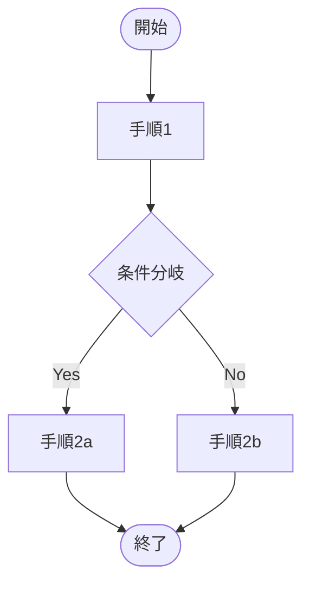

## Markdownコンテンツルール

以下のmarkdownコンテンツルールは、バリデータで強制されます：

1. **見出し**: コンテンツを構造化するために適切な見出しレベル（H2、H3など）を使用。H1見出しは使用しない。これはタイトルに基づいて生成されます。
2. **リスト**: リストには箇条書きまたは番号付きリストを使用。適切なインデントと間隔を確保。
3. **コードブロック**: コードスニペットにはフェンス付きコードブロックを使用。構文ハイライトのために言語を指定。
4. **リンク**: リンクには適切なmarkdown構文を使用。リンクが有効でアクセス可能であることを確認。
5. **画像**: 画像には適切なmarkdown構文を使用。アクセシビリティのためalt textを含める。
6. **テーブル**: 表形式データにはmarkdownテーブルを使用。適切なフォーマットと配置を確保。
7. **行の長さ**: 読みやすさのため行の長さを400文字に制限。
8. **空白**: セクションを区切り、読みやすさを向上させるために適切な空白を使用。
9. **フロントマター**: ファイルの先頭に必須のメタデータフィールドを含むYAMLフロントマターを含める。

## フォーマットと構造

markdownコンテンツのフォーマットと構造化には、以下のガイドラインに従ってください：

- **見出し**: H2には `##`、H3には `###` を使用。見出しは階層的な方法で使用されることを確認。コンテンツにH4が含まれる場合は再構成を推奨し、H5の場合はより強く推奨。
- **リスト**: 箇条書きには `-` を、番号付きリストには `1.` を使用。ネストされたリストは2つのスペースでインデント。
- **コードブロック**: フェンス付きコードブロックを作成するには3連バッククォート（\`）を使用。構文ハイライトのため、開始バッククォートの後に言語を指定（例: \`\`\`csharp）。
- **リンク**: リンクには `[link text](URL)` を使用。リンクテキストが説明的であり、URLが有効であることを確認。
- **画像**: 画像には `` を使用。alt textに画像の簡単な説明を含める。
- **テーブル**: テーブルを作成するには `|` を使用。列が適切に配置され、ヘッダーが含まれていることを確認。
- **行の長さ**: 読みやすさを向上させるため、80文字で行を区切る。長い段落にはソフト改行を使用。
- **空白**: セクションを区切り、読みやすさを向上させるために空行を使用。過度な空白を避ける。

## Mermaid図解の活用

### 基本方針

理解を促進するために、Mermaid記法を使った図解を積極的に活用すること。構造や流れを視覚化することで、読者の理解度が大きく向上する。

### 図の種類と選択基準

内容に応じて最適な図の種類を選択する。

| 説明したい内容 | 推奨する図の種類 | Mermaid記法 |
|---|---|---|
| 処理・手続き・ワークフローの流れ | フローチャート | `flowchart TD` / `flowchart LR` |
| 構成要素と関係性 | 構成図 | `graph TD` / `graph LR` |
| 関係者・コンポーネント間のやり取り | シーケンス図 | `sequenceDiagram` |
| 状態の遷移 | 状態遷移図 | `stateDiagram-v2` |
| クラス構造・データ構造 | クラス図 | `classDiagram` |
| 時系列の工程・スケジュール | ガントチャート | `gantt` |
| 思考の整理・要素の洗い出し | マインドマップ | `mindmap` |

### 作成ルール

- ノードやラベルは日本語で記述すること
- 複雑になりすぎる場合は図を分割する（目安：1図あたり15ノード以内）
- 図の直後に要点を1〜2文で補足すること
- 色分けやスタイリングは可読性向上に有効な場合のみ使用する

### 記述例

~~~

~~~

上記は基本的なフローチャートの例である。開始から終了までの処理の流れを示している。

## 折りたたみ補足の活用

### 使用場面

本文の流れを阻害する補足情報は、`<details>` / `<summary>` タグで折りたたむこと。

以下のような情報が折りたたみに適している：

- 用語解説や前提知識の補足
- 具体的なコマンド例・設定例・手順の詳細
- トラブルシューティング情報
- 参考リンク集
- 発展的な内容・応用的な話題
- 歴史的経緯・背景の深掘り

### 記述ルール

- `<summary>` には折りたたみの内容が推測できるタイトルを付けること
- 資料の核心部分は折りたたまない（読者が必ず読むべき内容は本文に記載）
- `<details>` タグの開始直後と `</details>` 直前には**空行を入れる**こと（Markdownパーサー対応）

### 記述例

```html
<details>
<summary>補足：用語解説</summary>

ここに補足情報を記載する。
コードブロックや箇条書きも使用可能。

</details>
```

## 検証要件

以下の検証要件への準拠を確保してください：

- **フロントマター**: YAMLフロントマターに以下のフィールドを含めることを推奨：

  - `title`: ドキュメントのタイトル
  - `description`: ドキュメントの概要または簡単な説明
  - `date`: 作成日または更新日（YYYY-MM-DD形式推奨）
  - `author`: 著者名またはチーム名
  - `tags`: ドキュメントに関連するタグのリスト
  - `categories`: ドキュメントのカテゴリ分類（任意）

- **コンテンツルール**: コンテンツが上記で指定されたmarkdownコンテンツルールに従っていることを確認。
- **フォーマット**: コンテンツがガイドラインに従って適切にフォーマットおよび構造化されていることを確認。
- **検証**: ルールとガイドラインへの準拠を確認するために検証ツールを実行。
