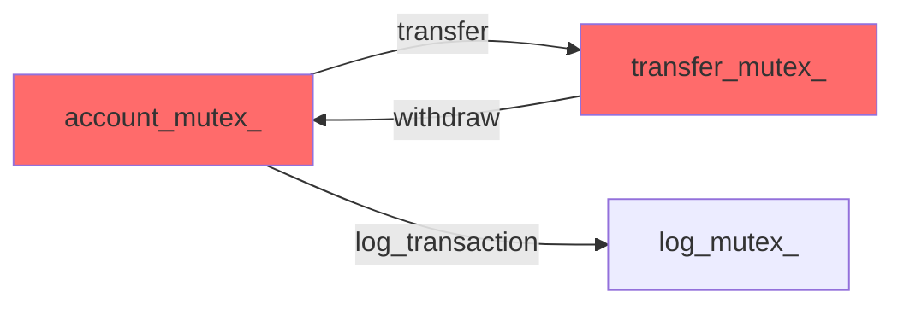
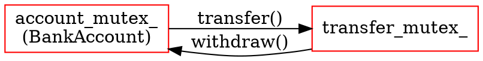

# C++ デッドロック静的解析

C++14のマルチスレッドコードを解析し、mutex/lockの使用パターンからデッドロックの可能性を検出します。ロック依存関係グラフを生成し、具体的な修正提案を提供します。

## 📋 ミッション

C++14のマルチスレッド環境における排他制御コードを静的解析し、以下を実現します:

1. **デッドロックシナリオの検出**: mutex、lock_guard、unique_lockの取得順序を分析
2. **ロック依存関係の可視化**: ロック取得順序をグラフで表現
3. **修正提案の生成**: 検出された問題に対する具体的な解決策を提示
4. **ベストプラクティスの適用**: RAII、lock階層、std::scooped_lockの活用

## 🎯 範囲と前提条件

### 対象コード
- **C++14標準準拠コード**（C++17機能は使用不可を前提）
- `std::mutex`, `std::recursive_mutex`, `std::timed_mutex`
- `std::lock_guard`, `std::unique_lock`
- `std::condition_variable`
- `std::lock` によるデッドロック回避
- **イベントドリブンアーキテクチャ**: コールバック、シグナル/スロット、メッセージキュー

### 前提条件
- 分析対象のC++ファイルがワークスペースに存在
- C++14コンパイラ環境（C++17の`std::scoped_lock`は使用不可）
- コードがコンパイル可能な状態である必要はない（静的解析のため）

### 分析対象シナリオ
1. **直接的なロック循環**: 関数内での複数mutex取得
2. **間接的なロック循環**: 関数呼び出しを通じた依存
3. **イベントドリブンのデッドロック**:
   - コールバック内でのロック取得
   - イベントハンドラーのネスト
   - シグナル/スロット機構での循環依存

### 除外項目
- 動的なロック取得パターン（実行時にしか決まらないもの）
- サードパーティライブラリの内部実装
- アセンブリレベルの同期プリミティブ

## 📥 入力

### 必須入力
- `${input:targetFiles}`: 分析対象のC++ファイル（ディレクトリまたは個別ファイル）

### オプション入力
- `${input:analysisDepth}`: 分析の深さ（`surface` / `deep` / `exhaustive`）デフォルト: `deep`
- `${input:outputFormat}`: 出力形式（`text` / `mermaid` / `graphviz`）デフォルト: `mermaid`

## 🔄 ワークフロー

### フェーズ 1: コードベースのスキャン

#### ステップ 1.1: 対象ファイルの特定
- `${input:targetFiles}` が指定された場合、そのファイル/ディレクトリを対象
- 未指定の場合、ワークスペース全体の `.cpp`, `.hpp`, `.h`, `.cc` ファイルを検索
- マルチスレッド関連のヘッダー (`<thread>`, `<mutex>`, `<condition_variable>`) を含むファイルをフィルタリング

```cpp
// 検出対象の例
#include <mutex>
#include <thread>
#include <shared_mutex>
```

#### ステップ 1.2: mutex変数の抽出
- クラスメンバー変数としてのmutex宣言を検出
- グローバルmutex変数を検出
- mutex変数の名前、型、スコープを記録

```cpp
// 検出例
class BankAccount {
    std::mutex account_mutex_;  // ← 記録
    std::shared_mutex shared_data_mutex_;  // ← 記録
};

std::mutex global_log_mutex;  // ← 記録
```

### フェーズ 2: ロック取得パターンの分析

#### ステップ 2.1: ロック取得箇所の特定
各関数・メソッドで以下のパターンを検索:

```cpp
// パターン1: lock_guard
std::lock_guard<std::mutex> lock(mutex_name);

// パターン2: unique_lock
std::unique_lock<std::mutex> lock(mutex_name);

// パターン3: 手動ロック
mutex_name.lock();
mutex_name.unlock();
```

#### ステップ 2.2: ロック取得順序の記録
各関数内でのロック取得順序を記録:

```cpp
void transfer(Account& from, Account& to) {
    std::lock_guard<std::mutex> lock1(from.mutex);  // 1番目
    std::lock_guard<std::mutex> lock2(to.mutex);    // 2番目
    // ↑ デッドロックの危険性を検出
}
```

記録内容:
- 関数名: `transfer`
- ロック順序: `from.mutex` → `to.mutex`
- ファイル位置: `bank.cpp:42-45`

#### ステップ 2.3: ネストされたロックの検出
関数呼び出しを通じた間接的なロック取得を追跡:

```cpp
void funcA() {
    std::lock_guard<std::mutex> lock(mutex1);
    funcB();  // ← funcB内でmutex2を取得
}

void funcB() {
    std::lock_guard<std::mutex> lock(mutex2);
    // mutex1 → mutex2 の順序を記録
}
```

### フェーズ 3: デッドロックシナリオの検出

#### ステップ 3.1: 循環依存の検出
ロック取得順序グラフから循環を検出:

```
検出アルゴリズム: 深さ優先探索 (DFS) で閉路検出

例:
  funcA: mutex1 → mutex2
  funcB: mutex2 → mutex1
  → デッドロックの可能性あり！
```

#### ステップ 3.1b: イベントドリブンのデッドロック検出

**パターン1: コールバック内のロック取得**
```cpp
void registerCallback() {
    std::lock_guard<std::mutex> lock(mutex1_);
    eventSystem.on("event", [this] {
        std::lock_guard<std::mutex> lock(mutex2_);  // コールバック内
    });
}

void triggerEvent() {
    std::lock_guard<std::mutex> lock(mutex2_);  // mutex2を先に取得
    eventSystem.emit("event");  // ← mutex1を取得しようとする
}
```

**検出方法**:
1. コールバック登録関数を特定（`std::function`, ラムダ、関数ポインタ）
2. コールバック内でのロック取得を記録
3. コールバック呼び出し元のロック状態を追跡
4. 逆向き依存の存在を確認

**パターン2: シグナル/スロットの循環**
```cpp
class Component {
    void onSignalA() {
        std::lock_guard<std::mutex> lock(mutex_);
        emit signalB();  // 他のコンポーネントへ
    }
};

class OtherComponent {
    void onSignalB() {
        std::lock_guard<std::mutex> lock(other_mutex_);
        emit signalA();  // 元のコンポーネントへ
    }
};
```

**検出方法**:
1. シグナル発行関数を特定（`emit`, `notify`, `trigger`）
2. シグナルハンドラーとロック取得の関係を記録
3. シグナルチェーンの循環を検出

#### ステップ 3.2: デッドロックパターンの分類

| パターン | 説明 | 危険度 |
|---------|------|-------|
| **単純循環** | 2つのmutexが逆順で取得される | 🔴 HIGH |
| **複雑循環** | 3つ以上のmutexが循環依存 | 🔴 HIGH |
| **イベントドリブン循環** | コールバック/シグナルを通じた間接的な循環 | 🔴 HIGH |
| **条件付き循環** | if文等で条件分岐するロック取得 | 🟡 MEDIUM |
| **タイミング依存** | 異なるスレッドでの競合 | 🟠 MEDIUM-HIGH |

#### ステップ 3.3: 誤検出の除外
以下のケースは安全として除外:

```cpp
// OK: std::lock（デッドロック回避アルゴリズム使用、C++14）
std::lock(mutex1, mutex2);
std::lock_guard<std::mutex> lock1(mutex1, std::adopt_lock);
std::lock_guard<std::mutex> lock2(mutex2, std::adopt_lock);
```

### フェーズ 4: ロック依存関係グラフの生成

#### ステップ 4.1: グラフ構造の構築
ノード: mutex変数
エッジ: ロック取得順序（関数名でラベル付け）

#### ステップ 4.2: グラフの可視化
`${input:outputFormat}` に応じて生成:

**Mermaid形式（デフォルト）**:


**Graphviz形式（詳細分析用）**:


### フェーズ 5: 修正提案の生成

#### ステップ 5.1: 問題ごとの修正戦略を選択

| 修正戦略 | 適用条件 | 優先度 |
|---------|---------|-------|
| **std::lock + adopt_lock** | 複数mutex（C++14推奨） | 🥇 1 |
| **ロック順序の統一** | 循環依存がシンプルな場合 | 🥇 1 |
| **ロック階層の導入** | mutexが多い場合 | 🥈 2 |
| **ロック粒度の変更** | 大きなクリティカルセクション | 🥉 3 |

#### ステップ 5.2: 具体的な修正コードの生成

**元のコード**:
```cpp
// ❌ デッドロックの危険性
void transfer(Account& from, Account& to, double amount) {
    std::lock_guard<std::mutex> lock1(from.mutex);
    std::lock_guard<std::mutex> lock2(to.mutex);
    
    from.balance -= amount;
    to.balance += amount;
}
```

**修正案1: std::lock + adopt_lock（C++14推奨）**:
```cpp
// ✅ デッドロック安全（C++14）
void transfer(Account& from, Account& to, double amount) {
    std::lock(from.mutex, to.mutex);
    std::lock_guard<std::mutex> lock1(from.mutex, std::adopt_lock);
    std::lock_guard<std::mutex> lock2(to.mutex, std::adopt_lock);
    
    from.balance -= amount;
    to.balance += amount;
}
```

**修正案2: ロック順序の統一**:
```cpp
// ✅ 常に小さいアドレスのmutexを先にロック
void transfer(Account& from, Account& to, double amount) {
    std::mutex* first = &from.mutex;
    std::mutex* second = &to.mutex;
    if (first > second) std::swap(first, second);
    
    std::lock_guard<std::mutex> lock1(*first);
    std::lock_guard<std::mutex> lock2(*second);
    
    from.balance -= amount;
    to.balance += amount;
}
```

#### ステップ 5.3: 修正の優先順位付け
各デッドロックシナリオに対して:

1. **危険度評価**: HIGH/MEDIUM/LOWに分類
2. **修正難易度評価**: EASY/MODERATE/DIFFICULTに分類
3. **影響範囲評価**: 変更が必要なファイル数/関数数

優先順位マトリクス:
```
危険度 HIGH + 難易度 EASY → 🚨 最優先
危険度 HIGH + 難易度 MODERATE → ⚠️ 優先
危険度 MEDIUM + 難易度 EASY → ⚠️ 優先
危険度 MEDIUM + 難易度 MODERATE → ⚡ 中程度
（以下略）
```

### フェーズ 6: レポートの生成

#### ステップ 6.1: エグゼクティブサマリー
```markdown
# デッドロック分析レポート

## 📊 分析サマリー
- **分析ファイル数**: 23ファイル
- **検出されたmutex**: 15個
- **ロック取得箇所**: 87箇所
- **検出されたデッドロックシナリオ**: 3件
  - 🔴 HIGH: 2件
  - 🟡 MEDIUM: 1件

## ⚠️ 緊急対応が必要な問題
1. [BankAccount::transfer と Account::withdraw の循環依存](#issue-1)
2. [ResourceManager の複数リソースロック](#issue-2)
```

#### ステップ 6.2: 詳細分析結果
各問題について以下を記載:

```markdown
## 🔴 問題 #1: BankAccount transfer デッドロック

### 概要
`BankAccount::transfer` と `Account::withdraw` で逆順のロック取得により、
デッドロックが発生する可能性があります。

### 発生条件
- スレッドA: transfer(account1, account2) を実行
- スレッドB: transfer(account2, account1) を同時実行

### コード位置
- [bank.cpp:42-48](bank.cpp:42-48)
- [bank.cpp:67-73](bank.cpp:67-73)

### ロック依存関係
\`\`\`mermaid
graph LR
    A[account1.mutex] -->|transfer| B[account2.mutex]
    B -->|transfer reverse| A
    style A fill:#ff6b6b
    style B fill:#ff6b6b
\`\`\`

### 推奨修正案
[修正案1: std::lock + adopt_lock](#fix-1-adopt-lock) 🥇

### 代替案
- [修正案2: ロック順序の統一](#fix-1-order)
```

#### ステップ 6.3: 修正優先順位リスト
```markdown
## 🎯 修正優先順位

### 最優先 🚨
1. **BankAccount::transfer デッドロック**
   - 危険度: HIGH / 難易度: EASY
   - 推定作業時間: 15分
   - 影響ファイル: 1ファイル

2. **ResourceManager デッドロック**
   - 危険度: HIGH / 難易度: MODERATE
   - 推定作業時間: 1時間
   - 影響ファイル: 3ファイル

### 優先 ⚠️
3. **Logger::flush の条件付きロック**
   - 危険度: MEDIUM / 難易度: EASY
   - 推定作業時間: 30分
   - 影響ファイル: 1ファイル
```

## 📤 出力期待値

### 1. デッドロック検出結果
- 検出されたすべてのデッドロックシナリオのリスト
- 各シナリオの危険度、影響範囲、発生条件

### 2. ロック依存関係グラフ
- Mermaid または Graphviz 形式
- 循環依存を視覚的に強調表示
- 関数名とファイル位置を注釈として記載

### 3. 具体的な修正提案
- 各問題に対する2-3の修正案
- Before/Afterのコード例
- 修正の利点と欠点の説明

### 4. 優先順位付きアクションリスト
- 修正すべき順序
- 推定作業時間
- 影響範囲の評価

## ✅ 品質保証

### 分析の網羅性チェック
- [ ] すべての `.cpp`, `.hpp`, `.h`, `.cc` ファイルをスキャン済み
- [ ] すべてのmutex変数を抽出済み
- [ ] すべてのロック取得箇所を記録済み
- [ ] 関数呼び出しを通じた間接的なロックも追跡済み

### 検出精度の検証
- [ ] 既知のデッドロックパターンをすべて検出
- [ ] 誤検出（false positive）を最小化
  - `std::lock` + `adopt_lock` を誤検出していない
- [ ] 見逃し（false negative）を最小化
  - 条件分岐内のロックも考慮済み

### 修正提案の品質
- [ ] すべての提案がコンパイル可能
- [ ] C++14標準に準拠（または代替案を提示）
- [ ] パフォーマンスへの影響を考慮
- [ ] 例外安全性を維持

### 出力の読みやすさ
- [ ] グラフが視覚的にわかりやすい
- [ ] コード例に構文ハイライトを使用
- [ ] 優先順位が明確
- [ ] 実行可能なアクションプランを提供

## 🔗 参考資料

### 内部ガイドライン
- [C++ 並行処理コーディング標準](../instructions/cpp-concurrency-standards.instructions.md)
- [C++ 並行処理アナライザーエージェント](../agents/analyze-cpp-concurrency.agent.md)

### C++ 標準とベストプラクティス
- [C++ Core Guidelines: CP (Concurrency and Parallelism)](https://isocpp.github.io/CppCoreGuidelines/CppCoreGuidelines#S-concurrency)
- [std::lock - cppreference](https://en.cppreference.com/w/cpp/thread/lock)
- [Mutex - cppreference](https://en.cppreference.com/w/cpp/thread/mutex)

### デッドロック検出理論
- [Banker's Algorithm](https://en.wikipedia.org/wiki/Banker%27s_algorithm)
- [Resource Allocation Graph](https://en.wikipedia.org/wiki/Resource_allocation_graph)

## 💡 使用例

### 例1: 単一ファイルの分析
```
@workspace Follow instructions in #file:.github/prompts/analyze-cpp-concurrency.prompt.md

targetFiles: src/bank_account.cpp
```

### 例2: ディレクトリ全体の分析
```
@workspace Follow instructions in #file:.github/prompts/analyze-cpp-concurrency.prompt.md

targetFiles: src/concurrent/
analysisDepth: exhaustive
outputFormat: mermaid
```

### 例3: ワークスペース全体の分析
```
@workspace Follow instructions in #file:.github/prompts/analyze-cpp-concurrency.prompt.md

analysisDepth: deep
```

### 例4: エージェントと連携
```
@analyze-cpp-concurrency Analyze the codebase for potential deadlocks and suggest fixes
```
