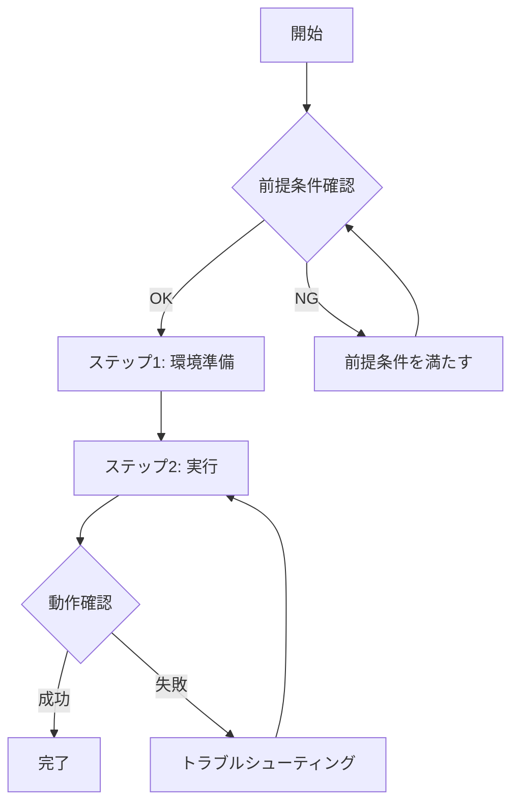
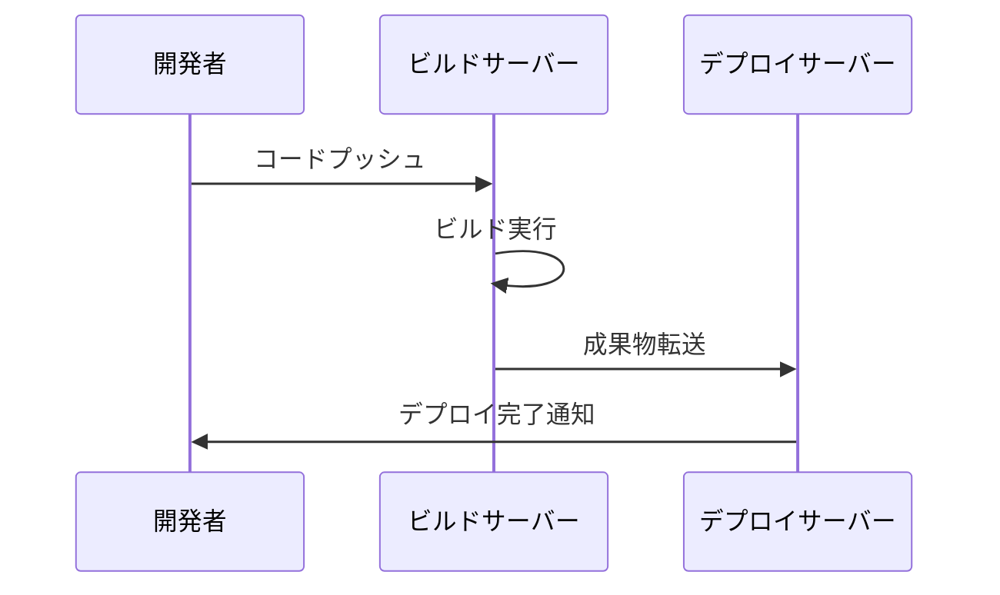
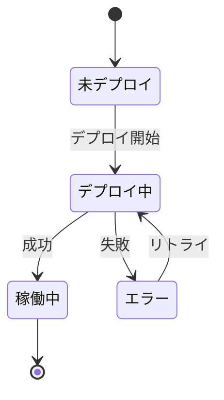

# 手順書生成プロンプト

このプロンプトは、開発手順書または運用手順書を構造化されたMarkdown形式で生成します。

## 📥 必須入力

- `${input:documentType}`: 手順書のタイプ (development | operation)
- `${input:targetSystem}`: 対象システム名
- `${input:procedureGoal}`: 手順の目的・ゴール
- `${input:targetAudience}`: 対象読者 (デフォルト: 新人開発者)

## 📋 生成する手順書の構造

以下の構成で手順書を生成します:

### 1. はじめに
- 手順書の目的
- 対象読者
- 想定される所要時間

### 2. Input
- 必要な情報・パラメータのテーブル
- 例: システム名、環境情報、アクセス権限など

### 3. 前提条件
- 必要な知識レベル
- 必要な環境・ツール
- 事前準備事項

### 4. 概要
- **Mermaid フローチャート**で全体の流れを可視化
- 各ステップの概要説明

### 5. ユースケース毎の手順
- ステップバイステップの詳細手順
- コマンド例
- 期待される結果
- トラブルシューティング

## 🎨 Mermaid活用ガイドライン

手順書には以下のMermaid図を含めること:

### フローチャート (必須)


### シーケンス図 (推奨)
複数システム間の連携がある場合:


### 状態図 (オプション)
システムの状態遷移がある場合:


## ✅ 品質チェックリスト

生成後、以下を確認:

- [ ] 全セクション(1-5)が含まれている
- [ ] Mermaid図で全体像が理解できる
- [ ] 新人開発者にも理解できる表現
- [ ] コマンド例が具体的
- [ ] エラー対処法が記載されている
- [ ] 用語集が必要な場合は追加されている

## 🔗 関連リソース

- [手順書作成ガイドライン](../instructions/procedure-document-standards.instructions.md)
- [テクニカルライターアシスタント](../agents/technical-writer-assistant.agent.md)

## 💡 使用例

```
#generate-procedure-document

Document Type: development
Target System: マイクロサービスAPI
Procedure Goal: 新しいAPIエンドポイントの追加とデプロイ
Target Audience: 入社1年目の開発者
```

## 📚 参考

自動適用されるルールについては [procedure-document-standards.instructions.md](../instructions/procedure-document-standards.instructions.md) を参照してください。
