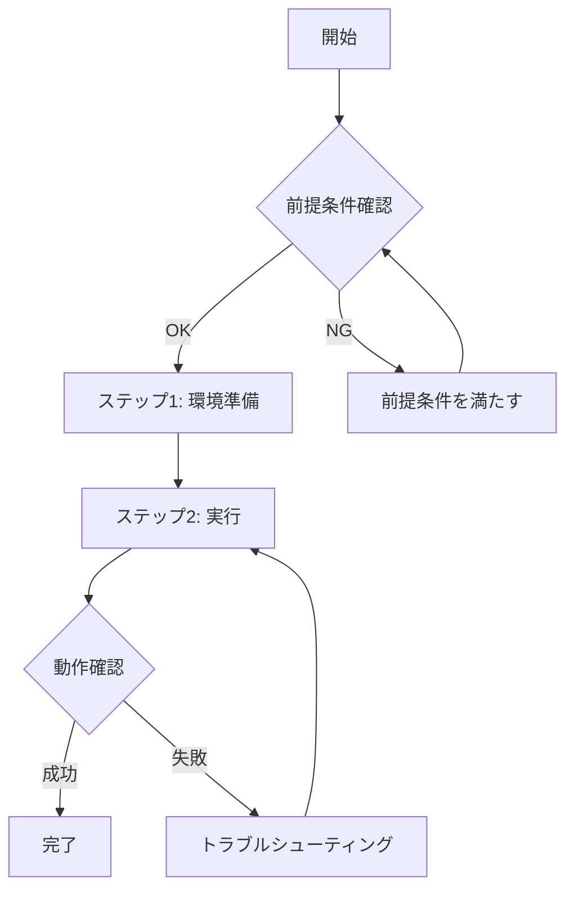
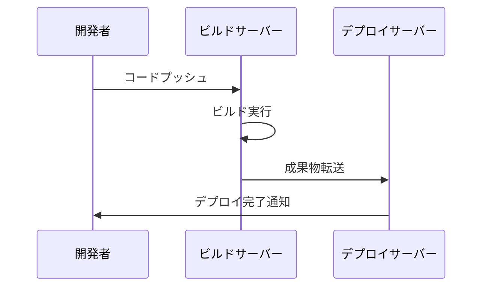
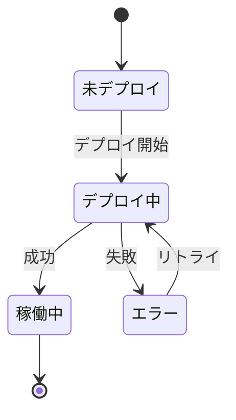

# 手順書生成プロンプト

このプロンプトは、開発手順書または運用手順書を構造化されたMarkdown形式で生成します。

## 📥 必須入力

手順書生成に必要な情報を指定してください:

- **ドキュメントタイプ**: `${input:documentType:development または operation を入力}`
  - `development`: 開発手順書（機能実装、環境構築、デプロイ）
  - `operation`: 運用手順書（システム運用、障害対応、定常作業）

- **対象システム**: `${input:targetSystem:対象システム名を入力}`
  - 例: マイクロサービスAPI、Kubernetesクラスター、データベース

- **手順の目的**: `${input:procedureGoal:達成したい目的を具体的に入力}`
  - 例: 新しいAPIエンドポイントの追加とデプロイ、障害発生時の復旧手順

- **対象読者**: `${input:targetAudience:新人開発者}` (デフォルト: 新人開発者)
  - 想定する読者層の経験レベル

## 📋 生成する手順書の構造

以下の構成で手順書を生成します:

### 1. はじめに
- 手順書の目的
- 対象読者
- 想定される所要時間

### 2. Input
- 必要な情報・パラメータのテーブル
- 例: システム名、環境情報、アクセス権限など

### 3. 前提条件
- 必要な知識レベル
- 必要な環境・ツール
- 事前準備事項

### 4. 概要
- **Mermaid フローチャート**で全体の流れを可視化
- 各ステップの概要説明

### 5. ユースケース毎の手順
- ステップバイステップの詳細手順
- コマンド例
- 期待される結果
- トラブルシューティング

## 🎨 Mermaid活用ガイドライン

手順書には以下のMermaid図を含めること:

### フローチャート (必須)


### シーケンス図 (推奨)
複数システム間の連携がある場合:


### 状態図 (オプション)
システムの状態遷移がある場合:


## ✅ 品質チェックリスト

生成後、以下を確認:

- [ ] 全セクション(1-5)が含まれている
- [ ] Mermaid図で全体像が理解できる
- [ ] 新人開発者にも理解できる表現
- [ ] コマンド例が具体的
- [ ] エラー対処法が記載されている
- [ ] 用語集が必要な場合は追加されている

## �️ 使用するツール

このプロンプトは以下のツールを活用します:

- #tool:read - 既存ファイルやテンプレートの読み取り
- #tool:search - 関連ドキュメントやコード例の検索
- #tool:edit - 手順書ファイルの作成・編集
- #tool:web - 外部リソースの取得（必要に応じて）

## 🔗 関連リソース

- [テクニカルライターアシスタント](../agents/generate-procedure-document.agent.md)
- [Markdown記法ガイド](../instructions/markdown.instructions.md)

## 💡 使用例

```
#generate-procedure-document

Document Type: development
Target System: マイクロサービスAPI
Procedure Goal: 新しいAPIエンドポイントの追加とデプロイ
Target Audience: 入社1年目の開発者
```

## 📚 参考

手順書作成の詳細なガイドラインは、[テクニカルライターアシスタント](../agents/generate-procedure-document.agent.md)に統合されています。
