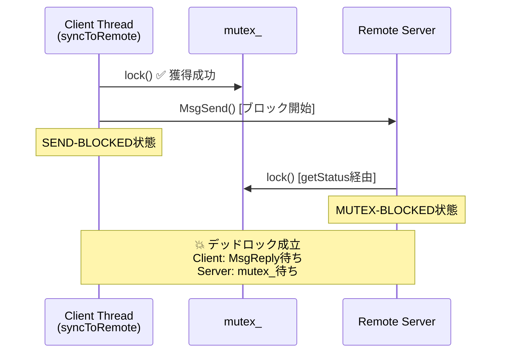

# 並行処理リスク分析の例

## 分析対象コード

```cpp
// src/data_manager.cpp
class DataManager {
public:
    void updateFromIpc(int chid) {
        struct _msg_info info;
        char buf[256];
        int rcvid = MsgReceive(chid, buf, sizeof(buf), &info);  // line 30

        std::lock_guard<std::mutex> lock(mutex_);  // line 32
        parseAndStore(buf, info.msglen);
    }

    Status getStatus() {
        std::lock_guard<std::mutex> lock(mutex_);  // line 37
        return currentStatus_;
    }

    void syncToRemote() {
        std::lock_guard<std::mutex> lock(mutex_);  // line 42
        auto data = serialize(currentData_);
        MsgSend(remoteCoid_, data.data(), data.size(), nullptr, 0);  // line 44
    }

private:
    std::mutex mutex_;
    Status currentStatus_;
    DataStore currentData_;
    int remoteCoid_;
};
```

## 分析結果

### リスクサマリーテーブル

| # | リスクレベル | カテゴリ | ファイル:行 | リスク概要 | 影響 |
|---|-----------|---------|-----------|----------|------|
| 1 | 🔴 High | デッドロック | `src/data_manager.cpp:42-44` | mutex_保持中にMsgSend（ブロッキング）を呼び出し | システムハング |
| 2 | 🟡 Medium | レースコンディション | `src/data_manager.cpp:30-32` | MsgReceiveとロック獲得の間にギャップ | データ不整合の可能性 |

### リスク #1: mutex保持中のMsgSendによるデッドロック

**リスクレベル:** 🔴 High
**カテゴリ:** デッドロック
**ファイル:** `src/data_manager.cpp:42-44`

#### 該当コード

```cpp
void syncToRemote() {
    std::lock_guard<std::mutex> lock(mutex_);  // line 42: mutex_ 獲得
    auto data = serialize(currentData_);
    MsgSend(remoteCoid_, data.data(), data.size(), nullptr, 0);  // line 44: ブロック
}
```

#### リスク説明

`syncToRemote()`は`mutex_`を保持した状態で`MsgSend`を呼び出す。
`MsgSend`はリモートサーバーが`MsgReply`するまでスレッドをブロックする。
リモートサーバーが`DataManager::getStatus()`を呼び出す場合、`mutex_`の
獲得を試みるが、`syncToRemote()`が保持しているため永久にブロックされる。
結果として、双方が相手の完了を待つデッドロックが成立する。

#### リスク顕在化シーケンス



#### 修正提案

```cpp
void syncToRemote() {
    std::vector<uint8_t> data;
    {
        std::lock_guard<std::mutex> lock(mutex_);  // 最小スコープでロック
        data = serialize(currentData_);
    }  // ここでmutex_解放

    // ロック解放後にMsgSend（ブロッキング操作）
    MsgSend(remoteCoid_, data.data(), data.size(), nullptr, 0);
}
```

#### 修正のポイント

- mutex保持スコープを最小化し、データのシリアライズまでに限定
- ブロッキングIPC（`MsgSend`）はロック解放後に実行
- ロック外でコピーしたデータを使うことで、送信中のデータ一貫性も確保
