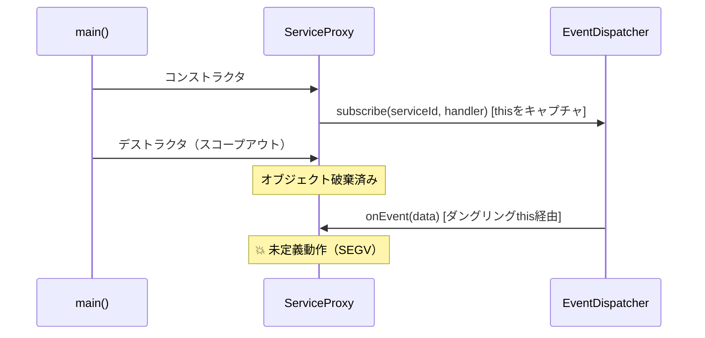

# メモリ安全性分析の例

## 分析対象コード

```cpp
// src/service_proxy.cpp
class ServiceProxy {
public:
    void registerCallback() {
        auto handler = std::bind(&ServiceProxy::onEvent, this, std::placeholders::_1);
        eventDispatcher_->subscribe(serviceId_, handler);  // line 45
    }

    void onEvent(const EventData& data) {
        buffer_.write(data.payload, data.size);  // line 50
    }

    ~ServiceProxy() {
        // コールバック解除なしで破棄
    }  // line 55

private:
    std::unique_ptr<EventDispatcher> eventDispatcher_;
    FixedBuffer<1024> buffer_;
    ServiceId serviceId_;
};

// src/main.cpp
void setupServices() {
    {
        ServiceProxy proxy;
        proxy.registerCallback();
    }  // line 72: proxyがスコープアウトで破棄
    // しかしeventDispatcher内にコールバックが残存
}
```

## 分析結果

### リスクサマリーテーブル

| # | リスクレベル | カテゴリ | ファイル:行 | リスク概要 | 影響 |
|---|-----------|---------|-----------|----------|------|
| 1 | 🔴 High | ダングリングポインタ | `src/service_proxy.cpp:45` | thisポインタをbindでキャプチャしコールバック登録。デストラクタでunsubscribeなし | クラッシュ（SEGV） |
| 2 | 🟡 Medium | バッファオーバーフロー | `src/service_proxy.cpp:50` | FixedBuffer<1024>にdata.sizeのチェックなしで書き込み | メモリ破壊 |

### リスク #1: コールバック経由のダングリングポインタ

**リスクレベル:** 🔴 High
**カテゴリ:** メモリ安全性（ダングリングポインタ）
**ファイル:** `src/service_proxy.cpp:45, 55`

#### 該当コード

```cpp
auto handler = std::bind(&ServiceProxy::onEvent, this, std::placeholders::_1);
eventDispatcher_->subscribe(serviceId_, handler);  // line 45
// ...
~ServiceProxy() {
    // unsubscribe が呼ばれていない
}  // line 55
```

#### リスク説明

`std::bind`で`this`ポインタをキャプチャしてコールバック登録しているが、
`ServiceProxy`のデストラクタで`unsubscribe`を行っていない。
`ServiceProxy`オブジェクトが破棄された後にイベントが発火すると、
無効な`this`ポインタ経由でメンバ関数が呼ばれ、未定義動作（SEGV等）が発生する。

#### リスク顕在化シーケンス



#### 修正提案

```cpp
class ServiceProxy {
public:
    void registerCallback() {
        auto weak = weak_from_this();  // std::enable_shared_from_this を継承
        eventDispatcher_->subscribe(serviceId_,
            [weak](const EventData& data) {
                if (auto self = weak.lock()) {
                    self->onEvent(data);
                }
            });
    }

    ~ServiceProxy() {
        eventDispatcher_->unsubscribe(serviceId_);  // 明示的に解除
    }
    // ...
};
```

#### 修正のポイント

- デストラクタで明示的に`unsubscribe`を行い、コールバックの残存を防止
- `weak_ptr`パターンにより、オブジェクト破棄後のコールバック呼び出しを安全に無視
- 2重の防御（unsubscribe + weak_ptr）で堅牢性を確保
