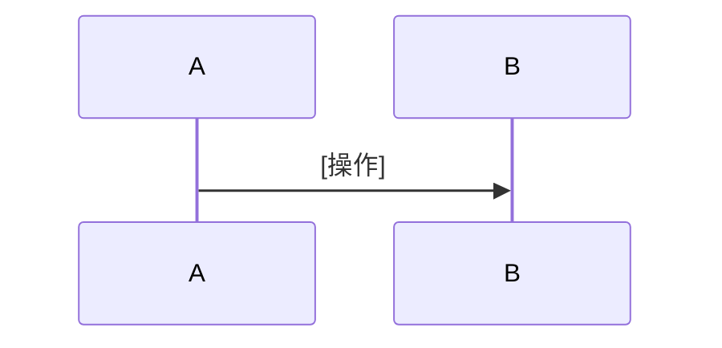

# リスク分析レポート

## 分析情報

| 項目 | 内容 |
|------|------|
| 分析日 | YYYY-MM-DD |
| 分析対象 | [モジュール名/ファイルパス] |
| 分析シナリオ | コードレビュー前 / リスク棚卸し / 原因分析 |
| 分析者 | Copilot + [レビュアー名] |

## リスクサマリー

| 合計 | 🔴 High | 🟡 Medium | 🟢 Low |
|------|---------|----------|--------|
| X件  | X件     | X件      | X件    |

## リスクサマリーテーブル

| # | リスクレベル | カテゴリ | ファイル:行 | リスク概要 | 影響 |
|---|-----------|---------|-----------|----------|------|
| 1 | 🔴 High | [カテゴリ] | `[file:line]` | [概要] | [影響] |

---

## リスク詳細

### リスク #1: [リスク概要]

**リスクレベル:** 🔴 High
**カテゴリ:** [メモリ安全性 / デッドロック / レースコンディション / IPC安全性]
**ファイル:** `[ファイルパス]:[行番号]`

#### 該当コード

```cpp
// 問題のあるコードを引用
```

#### リスク説明

[このコードパターンがなぜ危険なのかを説明]

#### リスク顕在化シーケンス



#### 修正提案

```cpp
// 修正後のコード
```

#### 修正のポイント

- [ポイント1]
- [ポイント2]

---

## 総合所見

[分析全体を通じた所見、構造的な傾向、推奨アクションをまとめる]
